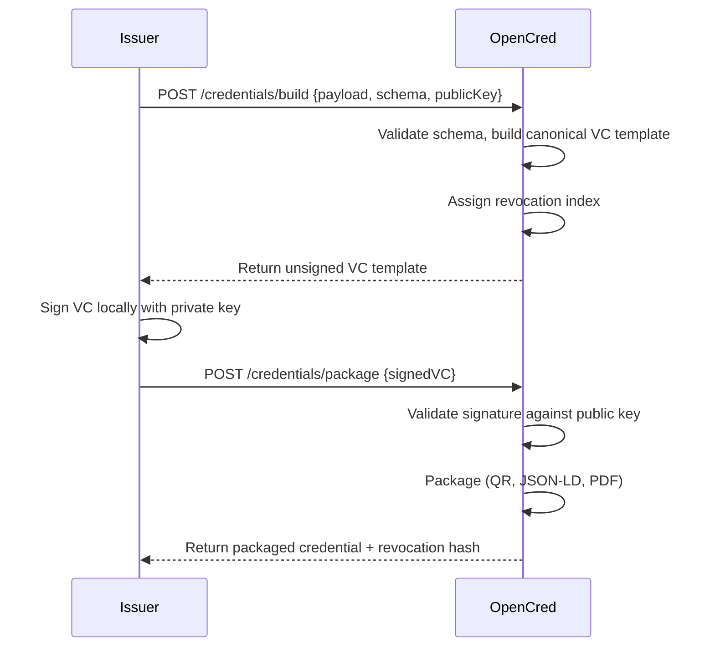
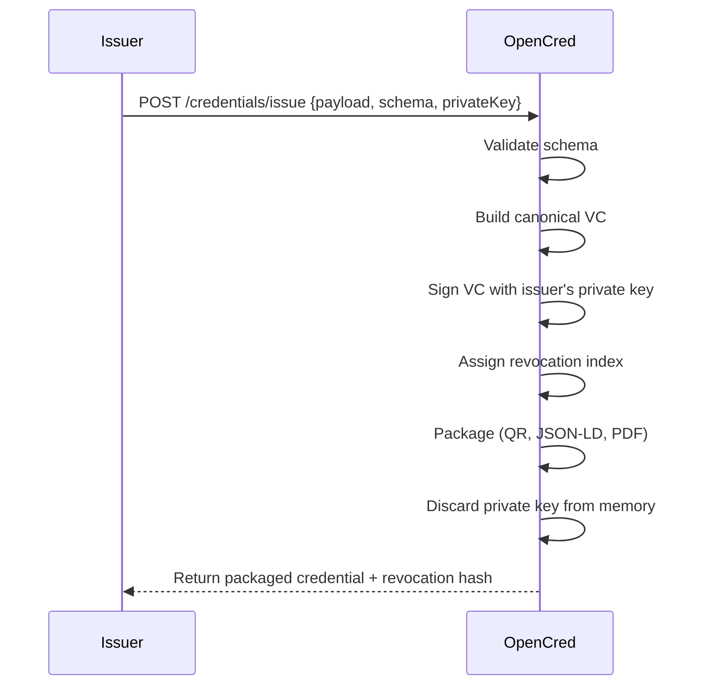
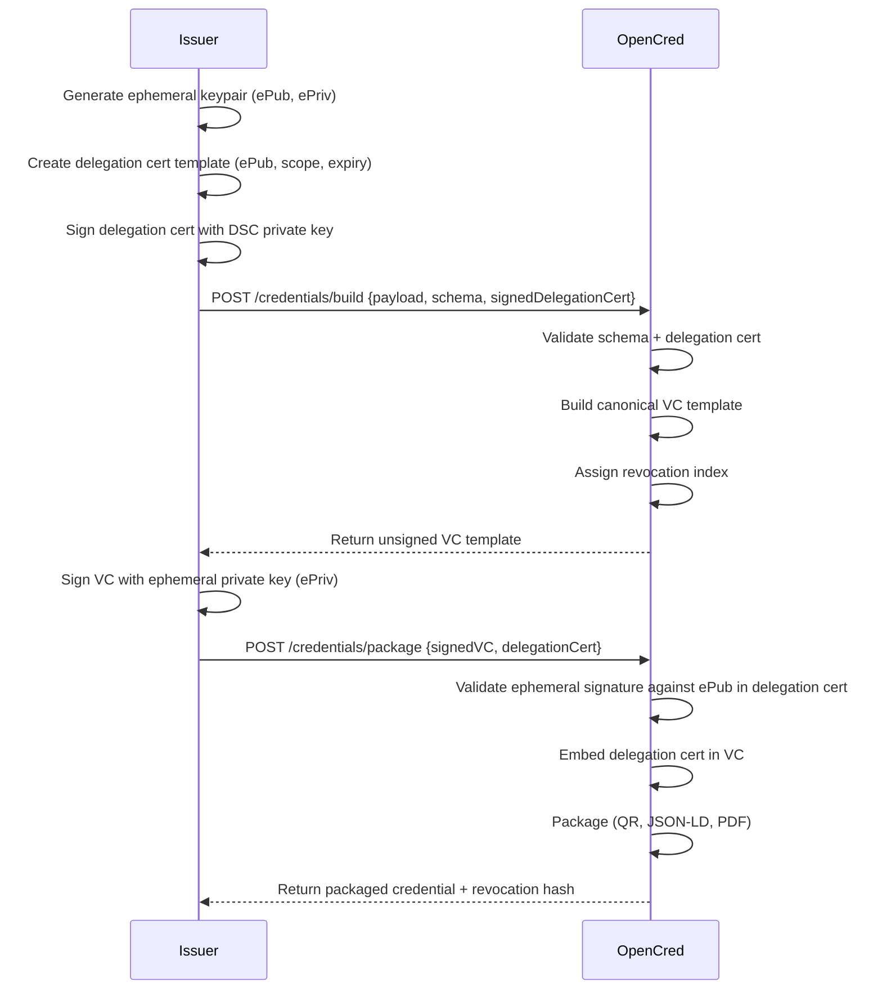
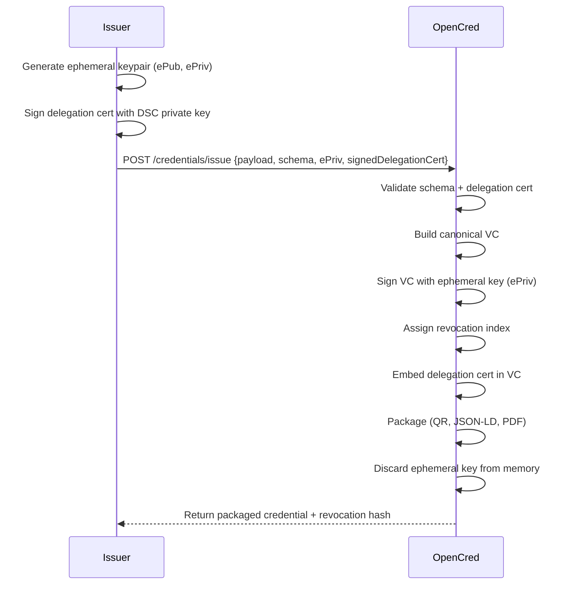
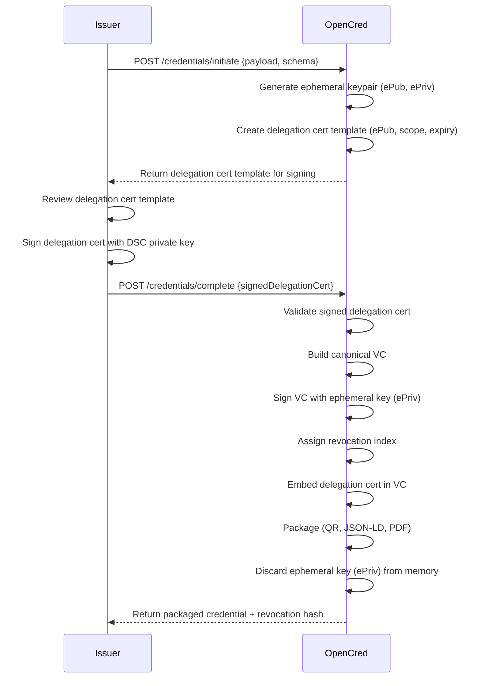
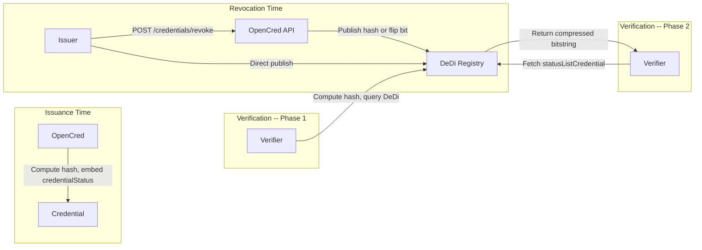
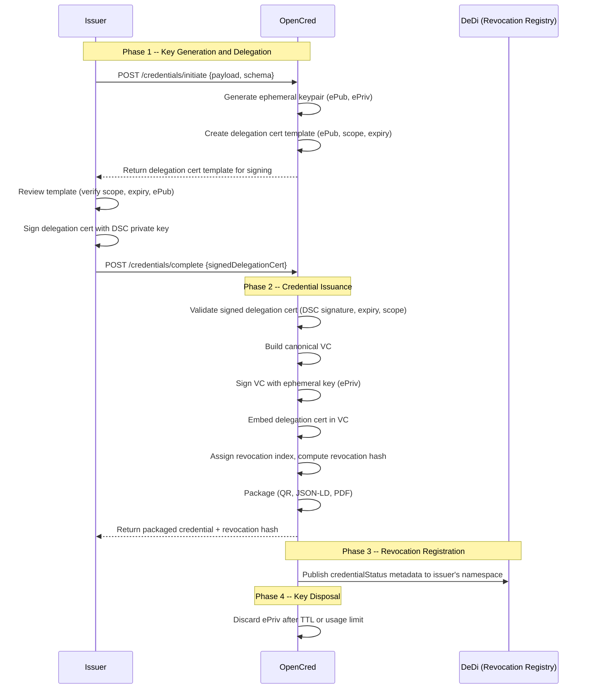
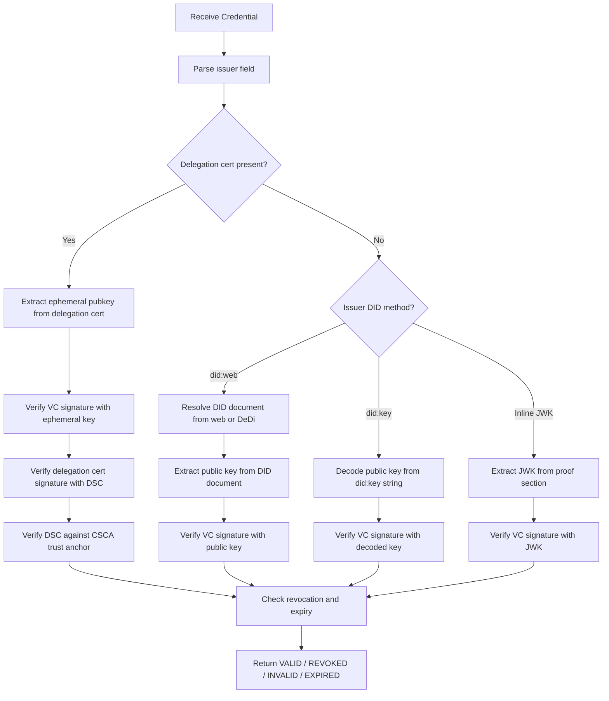
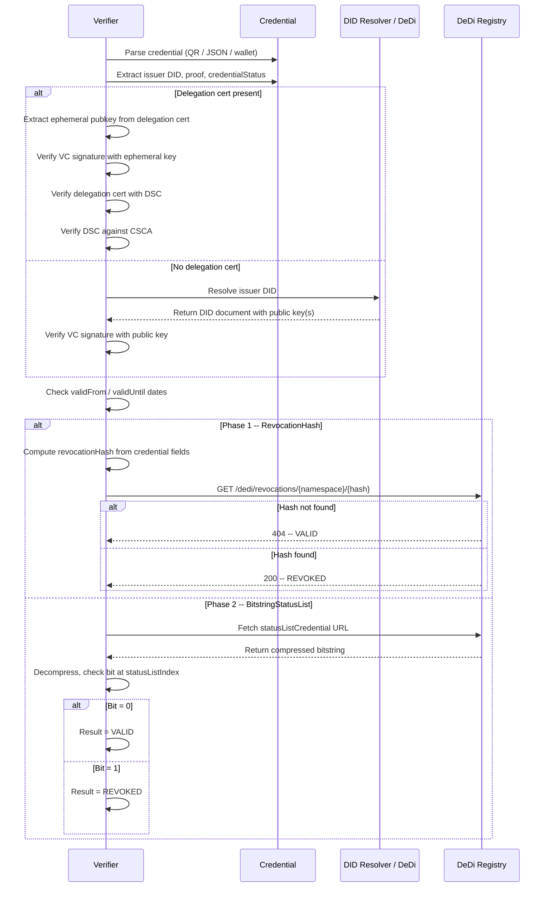

# OpenCred -- Product Requirements Document

**Version**: 1.0
**Date**: 9 February 2026
**Status**: Draft

---

## Table of Contents

1. [Executive Summary](#1-executive-summary)
2. [Personas](#2-personas)
3. [Issuer -- Key Sourcing Strategies](#3-issuer----key-sourcing-strategies)
4. [Issuer -- Self-Verifiable Credentials](#4-issuer----self-verifiable-credentials)
5. [Issuer -- credentialStatus for Revocation](#5-issuer----credentialstatus-for-revocation)
6. [Issuer -- Key Delegation via OpenCred](#6-issuer----key-delegation-via-opencred)
7. [Verifier -- Public Key Retrieval](#7-verifier----public-key-retrieval)
8. [Verifier -- Expiry and Revocation Checking](#8-verifier----expiry-and-revocation-checking)
9. [Appendix](#9-appendix)

---

## 1. Executive Summary

OpenCred is a minimalist, stateless verifiable credential (VC) issuance service available through both a web UI and a REST API. It is designed for any issuer -- from governments to individuals -- to produce W3C-conformant verifiable credentials without OpenCred ever persisting private keys, credential data, or personal information. The issuer retains full control over their cryptographic material; OpenCred acts only as a transient processing engine that validates schemas, builds canonical credential structures, manages revocation indices, and packages output (JSON-LD, QR code, PDF, SVG). All session data is purged within a configurable window (default: 4 hours).

---

## 2. Personas

### 2.1 Issuer

The entity that asserts claims about one or more subjects and produces a verifiable credential. Issuers include universities, employers, government agencies, healthcare providers, and individuals. The issuer controls the signing key (or delegates signing authority) and is responsible for revoking credentials when necessary.

### 2.2 Verifier

The entity that receives a verifiable credential (via QR scan, JSON file, or wallet presentation) and cryptographically verifies its authenticity, integrity, revocation status, and validity period. Verifiers include employers, border agencies, insurance companies, and online services.

### 2.3 Holder / Subject

The recipient of the credential who stores it in a digital wallet (compatible with Inji, Google Wallet, Apple Wallet) and presents it to verifiers on demand. The holder is often, but not always, the subject of the credential.

---

## 3. Issuer -- Key Sourcing Strategies

OpenCred supports five distinct flows for sourcing the signing key. The core design constraint is that **OpenCred never stores private keys persistently**. Each flow offers a different balance between security (key exposure risk) and convenience (who performs the signing operation).

### 3.1 Flow A -- Issuer's Own Key, Local Signing

The issuer's private key never leaves the issuer's environment. OpenCred only receives the unsigned credential payload, builds the canonical VC, and validates the signature after the issuer signs locally.

**When to use**: High-security environments where regulatory or organisational policy forbids transmitting the primary private key to any third party.

**Trust assumptions**: The issuer's local environment is secure. OpenCred is trusted only for schema validation and VC packaging, not for key custody.

**Security trade-offs**: Lowest risk of key compromise. Requires the issuer to have local signing capability (software or HSM).



### 3.2 Flow B -- Issuer's Own Key, OpenCred Signs

The issuer transmits their private key to OpenCred over a TLS-secured channel. OpenCred signs the credential on behalf of the issuer and immediately discards the key from memory.

**When to use**: Convenience-first scenarios where the issuer lacks local signing infrastructure and accepts the transient key-transmission risk.

**Trust assumptions**: The TLS channel is secure. OpenCred is trusted to discard the key after signing (auditable via secure enclave / TEE attestation in future releases).

**Security trade-offs**: The primary private key is transmitted over the network. Even though OpenCred discards it, a compromised OpenCred instance could exfiltrate the key during the signing window.



### 3.3 Flow C -- Local Ephemeral Key + DSC Delegation, Local Signing

The issuer generates an ephemeral keypair locally, creates a delegation certificate signed with their Document Signer Certificate (DSC), and uses the ephemeral key to sign the VC. The primary private key (DSC) is used only to sign the delegation certificate, never for the VC itself. OpenCred embeds the delegation certificate inside the credential so verifiers can chain trust.

**When to use**: Issuers who want the security of local signing combined with key-rotation benefits. Each batch of credentials can use a fresh ephemeral key.

**Trust assumptions**: The issuer's DSC is a trusted root. OpenCred is trusted only for schema validation and packaging.

**Security trade-offs**: The primary DSC private key never leaves the issuer. If the ephemeral key is compromised, only the credentials signed during that session are affected, and the delegation certificate's scope/expiry limits the blast radius.



### 3.4 Flow D -- Local Ephemeral Key + DSC Delegation, OpenCred Signs

Same delegation model as Flow C, but the issuer transmits the ephemeral private key to OpenCred for signing. Only the ephemeral key is transmitted -- the DSC private key remains with the issuer.

**When to use**: Issuers who want delegation-based trust chains but prefer server-side signing for convenience. Risk is mitigated because only an ephemeral key (not the primary DSC key) is transmitted.

**Trust assumptions**: TLS channel is secure. OpenCred discards the ephemeral key after signing.

**Security trade-offs**: An ephemeral (short-lived, scoped) key is transmitted rather than the primary key. Compromise impact is bounded by the delegation certificate's expiry and scope constraints.



### 3.5 Flow E -- OpenCred-Generated Ephemeral Key + DSC Delegation

OpenCred generates the ephemeral keypair itself and never transmits the private key outside its boundary. The issuer only signs the delegation certificate with their DSC. This is the recommended delegation flow (see Section 6).

**When to use**: Issuers who want the strongest separation of concerns -- the primary DSC key stays with the issuer, and the ephemeral key stays with OpenCred. Neither party holds both keys simultaneously.

**Trust assumptions**: OpenCred is trusted to generate secure randomness and discard the ephemeral key after use.

**Security trade-offs**: No private key is transmitted over the network at any point. The ephemeral key exists only within OpenCred's memory during the signing session.



### 3.6 Flow Comparison Matrix

| Attribute | Flow A | Flow B | Flow C | Flow D | Flow E |
|---|---|---|---|---|---|
| Who signs the VC | Issuer | OpenCred | Issuer | OpenCred | OpenCred |
| Private key transmitted | No | Yes (primary) | No | Yes (ephemeral) | No |
| Delegation cert required | No | No | Yes | Yes | Yes |
| Key rotation built-in | No | No | Yes | Yes | Yes |
| Issuer infrastructure needed | Signing capability | None | Signing + keygen | Keygen | DSC only |
| Recommended for | High-security | Quick start | Enterprise | Enterprise (convenience) | Delegation (default) |

---

## 4. Issuer -- Self-Verifiable Credentials

A credential is "self-verifiable" when a verifier can authenticate it without relying on a proprietary lookup or out-of-band trust establishment. There are three primary approaches for making the public key available to verifiers.

### 4.1 Option A: Publish Public Key to a Web-Accessible Endpoint

The issuer publishes their public key(s) inside a DID document hosted at a well-known web URL. The most common method is `did:web`.

**Mechanism**: The issuer hosts a DID document at `https://<domain>/.well-known/did.json`. This document contains one or more `verificationMethod` entries with the public key(s) in JWK or Multibase format. The credential's `issuer` field contains the DID (e.g., `did:web:example.com`), which the verifier resolves to fetch the public key.

**Example DID Document** (`https://university.example/.well-known/did.json`):

```json
{
  "@context": [
    "https://www.w3.org/ns/did/v1",
    "https://w3id.org/security/suites/jws-2020/v1"
  ],
  "id": "did:web:university.example",
  "verificationMethod": [
    {
      "id": "did:web:university.example#key-1",
      "type": "JsonWebKey2020",
      "controller": "did:web:university.example",
      "publicKeyJwk": {
        "kty": "EC",
        "crv": "P-256",
        "x": "f83OJ3D2xF1Bg8vub9tLe1gHMzV76e8Tus9uPHvRVEU",
        "y": "x_FEzRu9m36HLN_tue659LNpXW6pCyStikYjKIWI5a0"
      }
    }
  ],
  "authentication": ["did:web:university.example#key-1"],
  "assertionMethod": ["did:web:university.example#key-1"]
}
```

**Advantages**:

- Follows standard DID resolution (W3C DID Core 1.0, DID Resolution v0.3).
- Supports key rotation: the issuer updates the DID document with new keys while retaining old ones for previously-issued credentials.
- Widely supported by VC libraries and wallets.
- The domain's TLS certificate provides an additional layer of trust binding the DID to the organisation.

**Disadvantages**:

- Requires the issuer to maintain a publicly accessible web endpoint.
- The credential is not self-contained; verification requires a network call to resolve the DID.
- A compromised or unavailable domain prevents verification.

### 4.2 Option B: Embed Public Key Inside the Credential

The public key is encoded directly within the credential itself, either via a `did:key` identifier or an inline JWK in the proof section.

**Mechanism (did:key)**: The `did:key` method encodes the public key directly into the DID string. For example, `did:key:z6MkhaXg...` contains the full public key material. The verifier extracts and decodes the key from the DID without any network lookup.

**Mechanism (inline JWK)**: The `proof` section of the credential includes a `verificationMethod` with the public key as an inline JWK object.

**Example using did:key in the issuer field**:

```json
{
  "@context": ["https://www.w3.org/ns/credentials/v2"],
  "type": ["VerifiableCredential"],
  "issuer": "did:key:z6MkhaXgBZDvotDkL5257faiztiGiC2QtKLGpbnnEGta2doK",
  "validFrom": "2026-01-15T00:00:00Z",
  "credentialSubject": {
    "id": "did:example:holder123",
    "degree": {
      "type": "BachelorDegree",
      "name": "Bachelor of Science"
    }
  }
}
```

**Example using inline JWK in proof**:

```json
{
  "proof": {
    "type": "DataIntegrityProof",
    "cryptosuite": "ecdsa-rdfc-2019",
    "created": "2026-01-15T00:00:00Z",
    "verificationMethod": {
      "type": "JsonWebKey2020",
      "publicKeyJwk": {
        "kty": "EC",
        "crv": "P-256",
        "x": "f83OJ3D2xF1Bg8vub9tLe1gHMzV76e8Tus9uPHvRVEU",
        "y": "x_FEzRu9m36HLN_tue659LNpXW6pCyStikYjKIWI5a0"
      }
    },
    "proofPurpose": "assertionMethod",
    "proofValue": "z3FXQjecWufY46..."
  }
}
```

**Advantages**:

- Fully self-contained: verification is possible entirely offline with zero network dependency.
- Zero infrastructure needed by the issuer for key hosting.
- Ideal for ad-hoc, peer-to-peer, or field scenarios where connectivity is unreliable.

**Disadvantages**:

- No key rotation support: if the key is compromised, all credentials containing that key are affected and there is no mechanism to update the key material.
- Credential size increases (a JWK adds approximately 200-400 bytes).
- Trust anchoring is weaker -- the verifier must trust the key in the credential itself without an external trust root (unless a delegation certificate chain is embedded alongside it).

### 4.3 Option C: KERI -- Key Event Receipt Infrastructure

KERI provides a third model for self-verifiable credentials built on **self-certifying identifiers (SCIDs)** rather than web-hosted documents or embedded keys. The issuer's identifier is cryptographically derived from its inception key and is bound to an append-only **Key Event Log (KEL)** that records every key rotation, delegation, and revocation event.

**Mechanism**: The issuer creates an Autonomic Identifier (AID) whose root of trust is a cryptographic keypair, not a domain name or a registry. The AID is strongly bound at inception to the controlling keypair through a self-certifying prefix. Key state changes (rotations, delegations) are recorded as signed events in the KEL. Witnesses (a configurable set of receipt-generating nodes) countersign key events, providing a secondary root of trust without requiring a blockchain or centralised registry.

**Key pre-rotation**: KERI's defining feature is its pre-rotation scheme. At inception (or at any rotation), the issuer pre-commits to the hash of the *next* rotation key. This means an attacker who compromises the current signing key cannot rotate to a new key of their choosing -- only the pre-committed key (held offline by the issuer) can perform the rotation. This eliminates the foundational weakness of traditional PKI where a compromised key can authorise its own replacement.

**Trust modes**:

- **Direct mode**: The verifier obtains the KEL directly from the issuer or a mutually trusted witness. The verifier replays the KEL from inception to current state, verifying every event signature. No external registry needed.
- **Indirect mode**: Witnesses produce Key Event Receipt Logs (KERLs). The verifier fetches KERLs from multiple witnesses and applies KERI's Agreement Algorithm for Control Establishment (KA2CE) to reach consensus on the current key state. This provides high assurance even when the verifier has no direct relationship with the issuer.

**Example AID (simplified)**:

```
AID: EDP1vHcw_wc4M0MPCus291a6-lcU0Jv38ypPuw52HFz0
```

The AID prefix is derived from the inception event's public key, making it self-certifying. The verifier resolves the AID to a KEL (from the issuer, a witness, or a KERI watcher node) and replays it to obtain the current public key.

**Advantages**:

- **Secure key rotation via pre-rotation**: Key compromise does not enable attacker-controlled rotation, unlike `did:web` where domain compromise allows full key replacement.
- **No dependency on web infrastructure**: The identifier is not bound to a domain name, so domain expiry, DNS hijacking, or TLS certificate issues do not affect the identifier's integrity.
- **Decentralised without a blockchain**: Witnesses provide distributed consensus on key state without requiring a ledger.
- **End-verifiable**: Any party can independently verify the full key event history by replaying the KEL from inception.
- **Supports delegation natively**: KERI has built-in delegated AIDs where a delegator AID authorises a delegate AID via a delegation event in the KEL, aligning well with OpenCred's DSC delegation model.

**Disadvantages**:

- **Ecosystem maturity**: KERI specifications are at v0.9 (Trust Over IP Foundation / IETF draft). Library and wallet support is growing but not yet as widespread as `did:web` or `did:key`.
- **Operational complexity**: Issuers must manage witness infrastructure (or use a witness network provider) and maintain their KEL.
- **Verifier must obtain the KEL**: While no web server is needed, the verifier still requires access to the KEL (via a watcher, witness, or direct exchange). Fully offline verification is possible only if the KEL is bundled with the credential.
- **Credential size if KEL is embedded**: Bundling the KEL for offline verification increases credential size proportional to the number of key events.

### 4.4 Comparative Analysis

| Criterion | Option A (did:web) | Option B (did:key / inline JWK) | Option C (KERI) |
|---|---|---|---|
| Network dependency at verification | Yes (DID resolution) | No (offline capable) | Partial (KEL fetch, or offline if bundled) |
| Key rotation | Supported (update DID doc) | Not supported | Supported (pre-rotation, cryptographically pre-committed) |
| Pre-rotation security | No (domain compromise enables malicious rotation) | N/A | Yes (compromised key cannot authorise its own replacement) |
| Issuer infrastructure | Web server + TLS cert | None | Witness nodes (self-hosted or provider) |
| Credential size | Smaller (key not embedded) | Larger (+200-400 bytes) | Moderate (AID only) or larger if KEL bundled |
| Trust anchoring | Domain-bound (TLS + DID doc) | Self-asserted (or delegation cert) | Self-certifying (cryptographic inception binding) |
| Revocation of compromised key | Update DID document | No mechanism (must revoke all affected credentials) | Rotate via pre-committed key; old key provably superseded |
| Delegation support | External (delegation cert layered on top) | External (delegation cert layered on top) | Native (delegated AIDs in the KEL) |
| Decentralisation | Depends on DNS/TLS CA | Fully decentralised (no resolution) | Fully decentralised (witness consensus, no blockchain) |
| Standards maturity | W3C CCG did:web spec | W3C CCG did:key v0.9 | ToIP / IETF draft v0.9; growing implementations |

### 4.5 Recommendation

OpenCred SHOULD support all three options and let the issuer choose at issuance time:

- **Default for institutional issuers**: `did:web` -- provides key rotation, domain-bound trust, and aligns with enterprise identity infrastructure. Lowest barrier to adoption given existing web PKI.
- **Alternative for ad-hoc or offline-first use**: `did:key` or inline JWK -- enables fully self-contained credentials for field deployment, peer-to-peer issuance, or testing.
- **For high-assurance / decentralised deployments**: KERI -- provides cryptographically pre-committed key rotation, native delegation, and decentralised trust without blockchain dependency. Recommended for issuers who require resilience against domain compromise or who operate in multi-stakeholder trust frameworks (e.g., government-to-government credential exchange).
- **Hybrid (recommended for delegation flows)**: Use `did:web` or a KERI AID as the issuer identifier with a delegation certificate embedded in the credential. The delegation cert contains the ephemeral public key and is signed by the issuer's DSC. This gives verifiers a trust chain (ephemeral key -> DSC -> CSCA) while keeping the credential verifiable even if the `did:web` endpoint is temporarily unreachable (the delegation cert is self-contained). KERI's native delegation model can replace the custom delegation certificate when both issuer and verifier support KERI.

---

## 5. Issuer -- credentialStatus for Revocation

Per the [W3C VC Data Model 2.0 -- Status](https://www.w3.org/TR/vc-data-model-2.0/#status), every credential issued by OpenCred will/should include a `credentialStatus` property to enable revocation checking by verifiers. OpenCred supports two revocation strategies, phased by implementation complexity.

### 5.1 Strategy Overview

| | Strategy A: DeDi RevocationHash Lookup | Strategy B: W3C BitstringStatusList |
|---|---|---|
| **Phase** | **Phase 1 (preferred for initial launch)** | Phase 2 |
| How it works | Each credential gets a deterministic hash. The hash is published to DeDi on revocation. Verifiers look up the hash directly. | Each credential gets a bit index in a compressed bitstring hosted at a URL. The bit is flipped to `1` on revocation. Verifiers download the bitstring and check locally. |
| Complexity | Low -- simple hash-based publish/lookup | Higher -- maintain and publish compressed bitstrings |
| Privacy | Registry sees which credential is being checked (1:1 query) | Herd privacy -- registry cannot tell which credential is checked (verifier downloads entire list) |
| W3C conformance | Custom (OpenCred/DeDi specific) | W3C Recommendation (interoperable with any conformant verifier) |
| Offline verification | No | Yes (cache the bitstring) |

### 5.2 Strategy A: DeDi RevocationHash Lookup (Phase 1)

This is the **preferred approach for Phase 1** due to its simplicity. OpenCred computes a deterministic hash for each credential and uses it as both the issuer-facing revocation handle and the verifier-facing status check.

**Revocation hash computation**:

```
revocationHash = SHA-256( JCS( credentialSubject + id + issuanceDate + issuer ) )
```

Where **JCS** is [JSON Canonicalization Scheme (RFC 8785)](https://www.rfc-editor.org/rfc/rfc8785).

**credentialStatus field** embedded in the credential:

```json
{
  "credentialStatus": {
    "id": "https://dedi.example/revocations/university.example/a1b2c3d4e5f6...",
    "type": "DeDiRevocationEntry",
    "statusPurpose": "revocation",
    "revocationRegistry": "https://dedi.example/revocations/university.example"
  }
}
```

**Issuance flow**: OpenCred computes the hash, embeds `credentialStatus` with the DeDi registry URL, and returns the hash to the issuer alongside the packaged credential.

**Revocation flow**: The issuer calls the revocation API with the hash. OpenCred (or the issuer directly) publishes the hash to the issuer's namespace in DeDi.

**Verification flow**: The verifier computes the same hash from the credential fields and queries DeDi. Hash found = REVOKED, not found = VALID.

### 5.3 Strategy B: W3C BitstringStatusList (Phase 2)

Adopts the [W3C Bitstring Status List v1.0](https://www.w3.org/TR/vc-bitstring-status-list/) (W3C Recommendation, May 2025). Each credential is assigned a bit in a GZIP-compressed bitstring (131,072 entries per list, ~16 KB uncompressed). Bit `0` = VALID, bit `1` = REVOKED.

**credentialStatus field**:

```json
{
  "credentialStatus": {
    "id": "https://dedi.example/status/university.example/3#94567",
    "type": "BitstringStatusListEntry",
    "statusPurpose": "revocation",
    "statusListIndex": "94567",
    "statusListCredential": "https://dedi.example/status/university.example/3"
  }
}
```

The status list itself is hosted on DeDi as a verifiable credential. Verifiers download the full list (cacheable), decompress, and check the bit at the credential's index -- the registry never learns which specific credential was checked.

**When to adopt**: Move to Strategy B when (a) verifier privacy requirements demand herd privacy, (b) W3C interoperability with third-party verifiers is needed, or (c) offline/cached verification is a priority.

### 5.4 DeDi as the Backing Store

DeDi (Decentralized Directory) serves as the verifiable data registry for both strategies. Each issuer has a namespace in DeDi.



### 5.5 Revocation API Endpoints

| Endpoint | Method | Request Body | Description |
|---|---|---|---|
| `/credentials/revoke` | POST | `{ "credentialHash": "<sha256-hex>" }` | Revoke a single credential. Phase 1: publishes hash to DeDi. Phase 2: also sets the corresponding bit to `1` in the status list. |
| `/credentials/revoke/batch` | POST | `{ "hashes": ["<hash1>", "<hash2>", ...] }` | Revoke multiple credentials in a single call. |

### 5.6 Revocation Lifecycle

| Step | Actor | Action | Details |
|---|---|---|---|
| At issuance | OpenCred | Computes revocation hash | `SHA-256(JCS(credentialSubject + id + issuanceDate + issuer))`. Returns hash to issuer alongside packaged credential. |
| At issuance | OpenCred | Embeds `credentialStatus` | Phase 1: DeDi revocation registry URL. Phase 2: also includes `statusListIndex` and `statusListCredential` URL. |
| To revoke | Issuer | Calls revocation API | `POST /credentials/revoke { credentialHash }` or publishes directly to DeDi. |
| To revoke | OpenCred / Issuer | Publishes to DeDi | Phase 1: adds hash to issuer's revocation registry. Phase 2: also flips the bit at the assigned index. |
| Bulk revoke | Issuer | Sends batch of hashes | `POST /credentials/revoke/batch { hashes[] }`. |

---

## 6. Issuer -- Key Delegation via OpenCred

The issuer can delegate credential signing to OpenCred by authorising an ephemeral keypair that OpenCred generates. This maps directly to **Flow E** (Section 3.5). OpenCred generates and holds the ephemeral key; the issuer's only cryptographic action is signing a delegation certificate with their DSC. DeDi's role in this flow is limited to serving as the **revocation registry** -- it does not generate, store, or use any signing keys.

### 6.1 What is a Delegation Certificate?

A delegation certificate is a signed assertion by the issuer that grants a specific ephemeral public key the authority to sign verifiable credentials on the issuer's behalf. It contains:

| Field | Description |
|---|---|
| `delegator` | The issuer's DID or DSC identifier (the entity granting authority). |
| `delegate` | The ephemeral public key being authorised. |
| `scope` | Constraints on what the ephemeral key may sign (e.g., credential types, schemas, maximum count). |
| `validFrom` | Start of the delegation validity window. |
| `validUntil` | End of the delegation validity window (expiry). |
| `proof` | Digital signature over the above fields, produced with the issuer's DSC private key. |

### 6.2 Delegation Flow



### 6.3 Trust Chain

The verifier establishes trust through a three-level certificate chain:

```
VC Signature (ephemeral key)
        |
        v
Delegation Certificate (signed by DSC)
        |
        v
Document Signer Certificate -- DSC (signed by CSCA or trust anchor)
        |
        v
Country Signing Certificate Authority -- CSCA (root of trust)
```

1. **Level 1**: The verifier checks the VC signature against the ephemeral public key found in the embedded delegation certificate.
2. **Level 2**: The verifier checks that the delegation certificate was signed by the issuer's DSC.
3. **Level 3**: The verifier checks that the DSC is issued by a trusted Certificate Authority (CSCA) or another recognised trust anchor.

### 6.4 Ephemeral Key Lifecycle

| Phase | Action | Actor |
|---|---|---|
| Generation | Generate ephemeral keypair using cryptographically secure randomness (CSPRNG). | OpenCred |
| Binding | Issuer signs delegation certificate binding ePub to their DSC. | Issuer |
| Storage | Hold ePriv in memory-only or encrypted volatile storage. Never persist to disk. | OpenCred |
| Usage | Sign one or more VCs within the delegation scope and validity window. | OpenCred |
| Disposal | Discard ePriv after: (a) TTL expiry, (b) usage count limit reached, or (c) explicit revocation by the issuer. | OpenCred |

### 6.5 Security Considerations

- **No key transmission**: The ephemeral private key is generated and used entirely within OpenCred. It is never transmitted to the issuer, to DeDi, or over any external network.
- **DeDi is revocation-only**: DeDi has no access to any signing keys. It only stores revocation status data (hashes or bitstrings) published by OpenCred on behalf of the issuer.
- **Scoped authority**: The delegation certificate constrains what the ephemeral key can sign, limiting the blast radius if the key is somehow compromised.
- **Short-lived keys**: Ephemeral keys have a configurable TTL (recommended: 1-24 hours). After expiry, the key is securely wiped from OpenCred's memory.
- **Auditability**: OpenCred logs delegation certificate creation and usage events for the issuer to audit.

---

## 7. Verifier -- Public Key Retrieval

The verifier needs to obtain the issuer's public key (or the ephemeral public key from a delegation certificate) to verify the credential's signature. Four options are available, depending on how the credential was issued.

### 7.1 Option 1: DID Resolution

The verifier resolves the `issuer` DID from the credential (e.g., `did:web:university.example`) using the [W3C DID Resolution](https://www.w3.org/TR/did-resolution/) process. This fetches the DID document from the issuer's domain and extracts the public key from the `verificationMethod` array.

**Applies when**: The credential's `issuer` field is a `did:web` identifier and no delegation certificate is present.

**Steps**:
1. Parse `issuer` field from the credential.
2. Resolve the DID using the appropriate DID method driver (e.g., `did:web` resolves to `https://<domain>/.well-known/did.json`).
3. Extract the `verificationMethod` referenced in the credential's `proof.verificationMethod`.
4. Use the extracted public key to verify the VC signature.

### 7.2 Option 2: DeDi Lookup

The verifier queries the DeDi registry for the issuer's DID document or public key(s). DeDi acts as a caching layer and verifiable data registry, providing faster lookups and availability guarantees.

**Applies when**: The verifier is configured to use DeDi as its resolution backend, or the credential's `issuer` DID is registered in DeDi.

**Steps**:
1. Parse `issuer` DID from the credential.
2. Query DeDi: `GET /dedi/resolve/{issuerDID}`.
3. DeDi returns the DID document (or a cached copy) with public key(s).
4. Extract the relevant public key and verify the VC signature.

### 7.3 Option 3: Embedded Key Extraction

If the credential uses `did:key` as the issuer identifier or includes an inline JWK in the proof, the verifier extracts the public key directly from the credential without any network call.

**Applies when**: The credential's `issuer` field is a `did:key` identifier, or the `proof.verificationMethod` contains an inline `publicKeyJwk`.

**Steps**:
1. If `issuer` is `did:key:z6Mk...`, decode the Multibase-encoded public key from the DID string.
2. If `proof.verificationMethod` contains an inline JWK, extract it directly.
3. Use the extracted public key to verify the VC signature.

**Caveat**: This option provides cryptographic verification but not trust anchoring. The verifier must decide whether to trust a self-asserted key or require additional evidence (e.g., a delegation certificate).

### 7.4 Option 4: Delegation Certificate Chain

If the credential contains an embedded delegation certificate, the verifier follows a multi-step trust chain verification.

**Applies when**: The credential contains a delegation certificate (Flows C, D, E).

**Steps**:
1. Extract the delegation certificate from the credential.
2. Extract the ephemeral public key (`delegate`) from the delegation certificate.
3. Verify the VC signature against the ephemeral public key.
4. Verify the delegation certificate's signature against the issuer's DSC public key.
5. Check the delegation certificate's `validFrom`/`validUntil` and `scope` constraints.
6. Verify the DSC against the trust anchor (CSCA or a trusted root certificate list).

### 7.5 Decision Table

| Credential Characteristic | Key Retrieval Option | Network Required |
|---|---|---|
| `issuer` = `did:web:*`, no delegation cert | Option 1 (DID Resolution) or Option 2 (DeDi) | Yes |
| `issuer` = `did:key:*`, no delegation cert | Option 3 (Embedded Key) | No |
| Inline JWK in `proof.verificationMethod` | Option 3 (Embedded Key) | No |
| Delegation certificate present | Option 4 (Delegation Chain) | Only for DSC/CSCA validation |
| `issuer` = `did:web:*`, delegation cert present | Option 4 first, fallback to Option 1 for DSC | Partial |

### 7.6 Verification Flow Overview



---

## 8. Verifier -- Expiry and Revocation Checking

After verifying the cryptographic signature, the verifier MUST check whether the credential is still current (not expired) and has not been revoked by the issuer.

### 8.1 Expiry Check

The W3C VC Data Model 2.0 uses `validFrom` and `validUntil` fields (replacing the v1.1 `issuanceDate` and `expirationDate` fields, though both are supported).

**Steps**:
1. Read the `validUntil` (or `expirationDate`) field from the credential.
2. Compare with the current date/time (UTC).
3. If the current date is **after** `validUntil`, the credential is **EXPIRED**.
4. Optionally, check `validFrom` -- if the current date is **before** `validFrom`, the credential is **NOT YET VALID**.

**Example fields in a credential**:

```json
{
  "validFrom": "2026-01-15T00:00:00Z",
  "validUntil": "2027-01-15T00:00:00Z"
}
```

### 8.2 Revocation Check

The verifier checks revocation using the `credentialStatus` field embedded in the credential. The method depends on which strategy the credential was issued under.

#### 8.2.1 Phase 1: DeDi RevocationHash Lookup (Primary)

The simplest and preferred method for Phase 1:

1. Extract the `revocationRegistry` URL from `credentialStatus`.
2. Compute `revocationHash = SHA-256(JCS(credentialSubject + id + issuanceDate + issuer))`.
3. Query DeDi: `GET /dedi/revocations/{issuerNamespace}/{revocationHash}`.
4. Hash found = **REVOKED**. Not found = **VALID**.

#### 8.2.2 Phase 2: BitstringStatusList Check

When the credential contains a `BitstringStatusListEntry`:

1. Read `statusListCredential` URL and `statusListIndex` from `credentialStatus`.
2. Fetch the status list credential from the URL (or from cache).
3. Verify the status list credential's own signature.
4. Decompress (GZIP) the `encodedList` bitstring.
5. Read the bit at `statusListIndex`. Bit `1` = **REVOKED**. Bit `0` = **VALID**.

**Example status list credential**:

```json
{
  "@context": ["https://www.w3.org/ns/credentials/v2"],
  "id": "https://dedi.example/status/university.example/3",
  "type": ["VerifiableCredential", "BitstringStatusListCredential"],
  "issuer": "did:web:dedi.example",
  "validFrom": "2026-01-01T00:00:00Z",
  "credentialSubject": {
    "id": "https://dedi.example/status/university.example/3#list",
    "type": "BitstringStatusList",
    "statusPurpose": "revocation",
    "encodedList": "H4sIAAAAAAAAA-3BMQEAAAgDoC..."
  }
}
```

### 8.3 Caching Strategy

| Parameter | Phase 1 (Hash Lookup) | Phase 2 (BitstringStatusList) |
|---|---|---|
| What to cache | DeDi query responses | Full status list credential |
| Cache TTL | 1-5 minutes | 5-15 minutes |
| Offline verification | Not supported | Supported (use cached bitstring) |
| Stale fallback | Return UNRESOLVABLE if DeDi is unreachable | Serve last-known bitstring, flag result as STALE |

### 8.5 Verification Result Codes

| Result | Condition |
|---|---|
| **VALID** | Signature verified, not expired, not revoked. |
| **REVOKED** | Signature verified, but the revocation bit is set to 1 (or hash found in DeDi). |
| **EXPIRED** | Signature verified, but `validUntil` date has passed. |
| **INVALID** | Signature verification failed (tampered or wrong key). |
| **UNRESOLVABLE** | The issuer's DID could not be resolved, or the status list URL is unreachable and no cache is available. |

### 8.6 Full Verification Sequence



---

## 9. Appendix

### 9.1 Sample Verifiable Credential (Complete)

The following example shows a fully-formed verifiable credential issued via OpenCred using Flow E (OpenCred-generated ephemeral key + DSC delegation), with all discussed fields included:

```json
{
  "@context": [
    "https://www.w3.org/ns/credentials/v2",
    "https://w3id.org/security/suites/jws-2020/v1"
  ],
  "id": "urn:uuid:7c5c3e9a-2a1f-4d3b-8e4c-123456789abc",
  "type": ["VerifiableCredential"],
  "issuer": "did:web:university.example",
  "validFrom": "2026-02-09T00:00:00Z",
  "validUntil": "2027-02-09T00:00:00Z",
  "credentialSubject": {
    "id": "did:example:holder456",
    "name": "Jane Doe",
    "degree": {
      "type": "BachelorDegree",
      "name": "Bachelor of Computer Science",
      "institution": "Example University"
    }
  },
  "credentialStatus": {
    "id": "https://dedi.example/status/university.example/3#94567",
    "type": "BitstringStatusListEntry",
    "statusPurpose": "revocation",
    "statusListIndex": "94567",
    "statusListCredential": "https://dedi.example/status/university.example/3"
  },
  "delegationCertificate": {
    "delegator": "did:web:university.example",
    "delegate": {
      "type": "JsonWebKey2020",
      "publicKeyJwk": {
        "kty": "EC",
        "crv": "P-256",
        "x": "Ux23xXAqJT1wOuqR-vNMwpHG9eT-aPQ4Mz_u_MzVcXE",
        "y": "Q9RfG_kF01Xe9C32bZ3pNMsO0oFP-JEfVLjCJHBXxkY"
      }
    },
    "scope": {
      "credentialTypes": ["BachelorDegree"],
      "maxIssuances": 500
    },
    "validFrom": "2026-02-09T00:00:00Z",
    "validUntil": "2026-02-10T00:00:00Z",
    "proof": {
      "type": "DataIntegrityProof",
      "cryptosuite": "ecdsa-rdfc-2019",
      "created": "2026-02-09T00:00:00Z",
      "verificationMethod": "did:web:university.example#dsc-key-1",
      "proofPurpose": "assertionMethod",
      "proofValue": "z4HJk2Qm8T3vN..."
    }
  },
  "proof": {
    "type": "DataIntegrityProof",
    "cryptosuite": "ecdsa-rdfc-2019",
    "created": "2026-02-09T00:00:00Z",
    "verificationMethod": "did:web:university.example#ephemeral-key-session-42",
    "proofPurpose": "assertionMethod",
    "proofValue": "z3FXQjecWufY46yXm..."
  }
}
```

### 9.2 Sample credentialStatus (Standalone)

```json
{
  "credentialStatus": {
    "id": "https://dedi.example/status/university.example/3#94567",
    "type": "BitstringStatusListEntry",
    "statusPurpose": "revocation",
    "statusListIndex": "94567",
    "statusListCredential": "https://dedi.example/status/university.example/3"
  }
}
```

### 9.3 Sample Revocation API Calls

**Single revocation**:

```bash
curl -X POST https://opencred.example/credentials/revoke \
  -H "Content-Type: application/json" \
  -H "Authorization: Bearer <issuer-token>" \
  -d '{
    "credentialHash": "a1b2c3d4e5f6...sha256hex"
  }'
```

**Batch revocation**:

```bash
curl -X POST https://opencred.example/credentials/revoke/batch \
  -H "Content-Type: application/json" \
  -H "Authorization: Bearer <issuer-token>" \
  -d '{
    "hashes": [
      "a1b2c3d4e5f6...sha256hex",
      "f6e5d4c3b2a1...sha256hex",
      "1234abcd5678...sha256hex"
    ]
  }'
```

### 9.4 Glossary

| Term | Definition |
|---|---|
| **BitstringStatusList** | A W3C standard (v1.0, May 2025) for publishing credential revocation/suspension status as a compressed bitstring. Each credential occupies one bit; `1` = revoked, `0` = valid. |
| **CSCA** | Country Signing Certificate Authority. The root certificate authority in a national PKI hierarchy (e.g., used in ICAO e-passports). The CSCA signs Document Signer Certificates. |
| **DeDi** | Decentralized Directory. A verifiable data registry used by OpenCred for DID resolution, public key caching, and revocation status hosting (hash registry and/or bitstring status lists). DeDi does not generate or store any signing keys. |
| **DID** | Decentralized Identifier. A portable, URL-based identifier (e.g., `did:web:example.com`) associated with an entity and resolvable to a DID document containing public keys and service endpoints. |
| **did:key** | A DID method that encodes the public key directly in the DID string (e.g., `did:key:z6Mk...`). No registry or network resolution needed. Best for ephemeral or offline use. |
| **did:web** | A DID method that resolves to a DID document hosted at `https://<domain>/.well-known/did.json`. Leverages existing web PKI (TLS) for trust anchoring. |
| **DSC** | Document Signer Certificate. An intermediate certificate issued by a CSCA, used by an organisation to sign documents or delegate signing authority to ephemeral keys. |
| **Ephemeral Key** | A short-lived cryptographic keypair generated for a single session or batch of credential issuances, then discarded. Limits the blast radius of key compromise. |
| **JCS** | JSON Canonicalization Scheme (RFC 8785). A deterministic serialisation of JSON objects used to produce a consistent byte representation for hashing or signing. |
| **JWK** | JSON Web Key (RFC 7517). A JSON data structure representing a cryptographic key, commonly used to embed public keys in DID documents and VC proofs. |
| **KEL** | Key Event Log. An append-only, cryptographically signed log of key lifecycle events (inception, rotation, delegation, revocation) used in KERI to establish verifiable key state. |
| **KERI** | Key Event Receipt Infrastructure. A decentralised key management protocol that uses self-certifying identifiers and pre-rotation to provide secure, end-verifiable control over cryptographic keys without reliance on a blockchain or centralised registry. |
| **VC** | Verifiable Credential. A tamper-evident, cryptographically signed credential conforming to the W3C VC Data Model. |
| **VP** | Verifiable Presentation. A tamper-evident wrapper around one or more VCs, presented by a holder to a verifier. |

### 9.5 References

| Reference | URL |
|---|---|
| W3C VC Data Model 2.0 | https://www.w3.org/TR/vc-data-model-2.0/ |
| W3C Bitstring Status List v1.0 | https://www.w3.org/TR/vc-bitstring-status-list/ |
| W3C VC Data Integrity 1.0 | https://www.w3.org/TR/vc-data-integrity/ |
| W3C Securing VCs using JOSE and COSE | https://www.w3.org/TR/vc-jose-cose/ |
| did:web Method Specification | https://w3c-ccg.github.io/did-method-web/ |
| did:key Method v0.9 | https://w3c-ccg.github.io/did-key-spec/ |
| W3C DID Resolution v0.3 | https://www.w3.org/TR/did-resolution/ |
| W3C DID Core 1.0 | https://www.w3.org/TR/did-core/ |
| KERI Specification (ToIP / IETF draft) | https://trustoverip.github.io/tswg-keri-specification/ |
| JSON Canonicalization Scheme (RFC 8785) | https://www.rfc-editor.org/rfc/rfc8785 |
| JSON Web Key (RFC 7517) | https://www.rfc-editor.org/rfc/rfc7517 |
