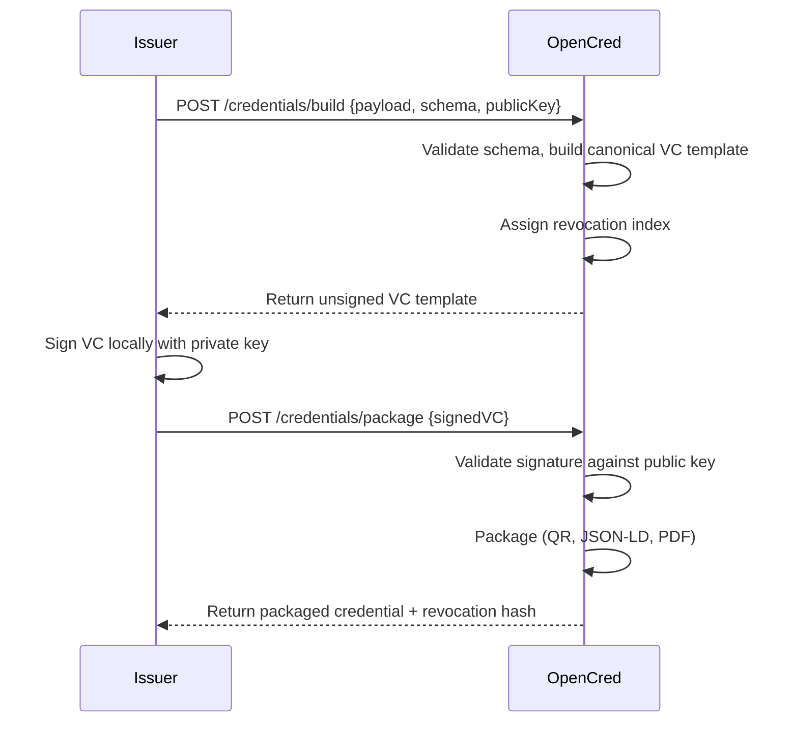
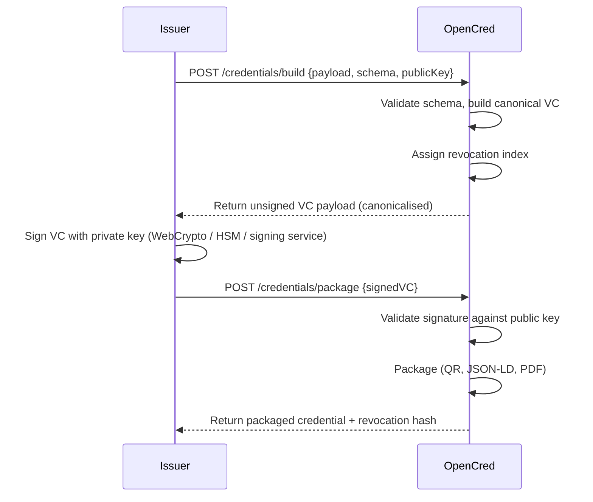
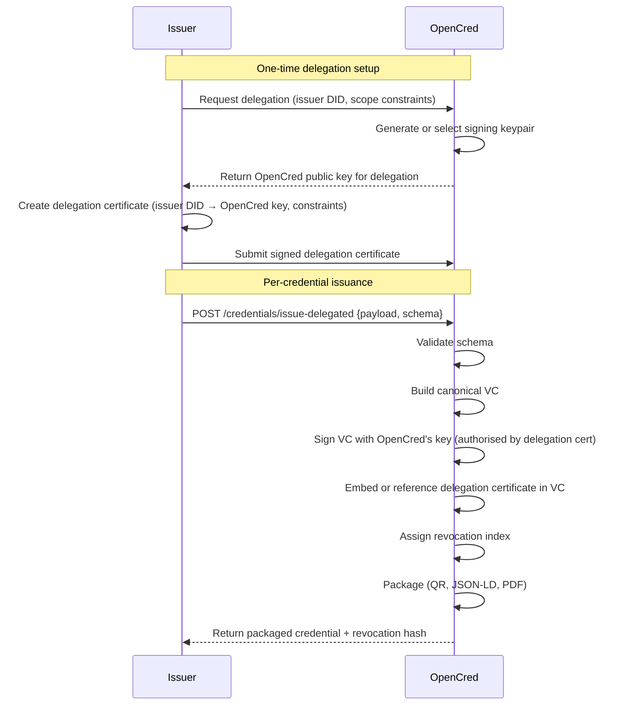
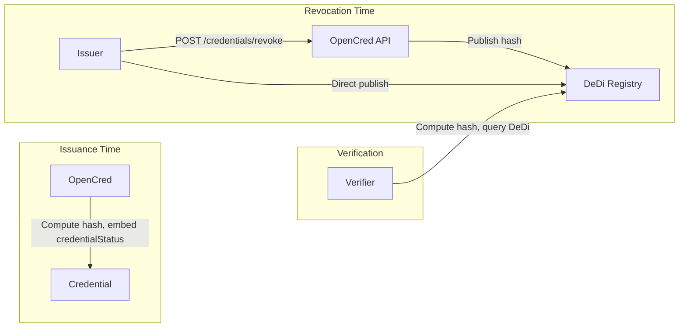
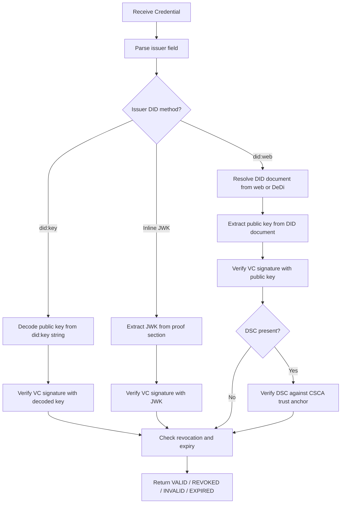
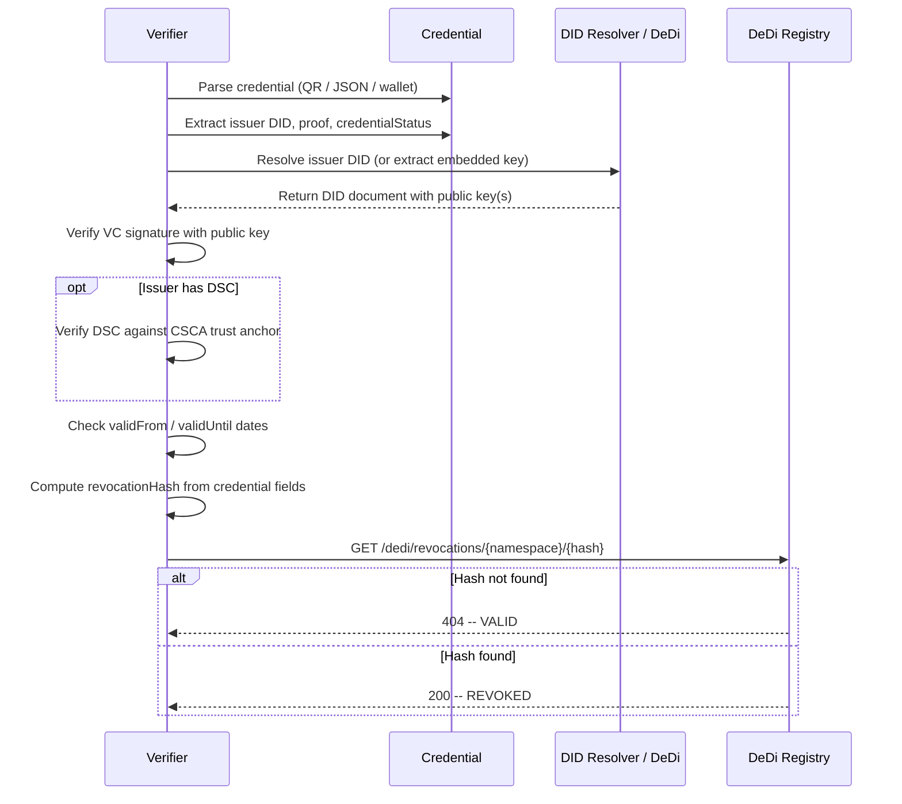

# OpenCred -- Product Requirements Document

**Version**: 1.0
**Date**: 9 February 2026
**Status**: Draft

---

## Table of Contents

1. [Executive Summary](#1-executive-summary)
2. [Personas](#2-personas)
3. [Interfaces](#3-interfaces)
4. [Issuer -- Onboarding and Trust Establishment](#4-issuer----onboarding-and-trust-establishment)
5. [Issuer -- Key Sourcing Strategies](#5-issuer----key-sourcing-strategies)
6. [Issuer -- Self-Verifiable Credentials](#6-issuer----self-verifiable-credentials)
7. [Issuer -- credentialStatus for Revocation](#7-issuer----credentialstatus-for-revocation)
8. [Verifier -- Public Key Retrieval](#8-verifier----public-key-retrieval)
9. [Verifier -- Expiry and Revocation Checking](#9-verifier----expiry-and-revocation-checking)
10. [Appendix](#10-appendix)

---

## 1. Executive Summary

OpenCred is a minimalist, stateless verifiable credential (VC) issuance and verification service. It is designed for any issuer -- from governments to individuals -- to produce W3C-conformant verifiable credentials without OpenCred ever persisting private keys, credential data, or personal information. The issuer retains full control over their cryptographic material; OpenCred acts only as a transient processing engine that validates schemas, builds canonical credential structures, manages revocation indices, and packages output (JSON-LD, QR code, PDF, SVG). All session data is purged within a configurable window (default: 4 hours).

OpenCred is available through three interfaces: a **Desktop Client** (fully local, offline-capable), a **Web UI**, and a **REST API**. The Desktop Client supports local signing only (Flow A). The Web UI and API support three signing flows: local signing (Flow A), issuer signs via OpenCred's interface (Flow B -- the issuer's private key never leaves the issuer's control; signing happens client-side through standard interfaces like WebCrypto or HSM), and delegated signing with OpenCred's own keys (Flow C -- for issuers without a DSC, where a delegation certificate authorises OpenCred's signing key).

OpenCred ships with a library of commonly used credential schemas (e.g., education certificates, employment credentials, identity documents, health records) so that issuers can begin issuing immediately without defining their own schemas. Issuers may also register custom schemas.

OpenCred builds on top of [Sunbird RC](https://docs.sunbirdrc.dev/) and [Inji Certify](https://docs.inji.io/inji-certify) for credential schema management and issuance primitives, extending them with OpenCred's key sourcing model, DeDi-backed revocation, and multi-interface support. Credential verification uses DeDi as the revocation registry.

---

## 2. Personas

### 2.1 Issuer

The entity that asserts claims about one or more subjects and produces a verifiable credential. Issuers include universities, employers, government agencies, healthcare providers, and individuals. The issuer controls the signing key (or delegates signing to OpenCred) and is responsible for revoking credentials when necessary.

OpenCred supports four issuer types, differentiated by how they establish trust:

#### 2.1.1 Type A -- Issuer with DSC

The issuer already holds a Document Signer Certificate (DSC) issued by a recognised Certificate Authority (CSCA or equivalent). Trust chain: VC signature → DSC → CSCA. This is the strongest trust model and typical of government agencies and large institutions.

#### 2.1.2 Type B -- Issuer without DSC, SSL-Based Trust

The issuer does not hold a DSC but operates a domain with a valid SSL/TLS certificate. Trust is anchored to the domain via `did:web` -- the issuer publishes their public key at `https://<domain>/.well-known/did.json`, and the domain's TLS certificate provides the trust binding. Suitable for businesses, universities, and organisations with established web presence.

#### 2.1.3 Type C -- Issuer without DSC, CA API Onboarding

The issuer does not hold a DSC but wishes to obtain one. OpenCred facilitates onboarding by connecting the issuer to Certificate Authority APIs that can issue a DSC based on the issuer's verified identity. Once onboarded, the issuer operates as Type A.

#### 2.1.4 Type D -- Issuer without DSC, Business VC Onboarding

The issuer does not hold a DSC but possesses an existing business verifiable credential (e.g., a verified business registration, trade licence, or institutional accreditation VC). OpenCred uses this existing credential to establish the issuer's identity and authority, bootstrapping trust from an already-verified credential chain.

### 2.2 Verifier

The entity that receives a verifiable credential (via QR scan, JSON file, or wallet presentation) and cryptographically verifies its authenticity, integrity, revocation status, and validity period. Verifiers include employers, border agencies, insurance companies, and online services.

### 2.3 Holder / Subject

The recipient of the credential who stores it in a digital wallet (compatible with Inji, Google Wallet, Apple Wallet) and presents it to verifiers on demand. The holder is often, but not always, the subject of the credential.

---

## 3. Interfaces

OpenCred is available through three interfaces. All interfaces produce identical W3C-conformant credentials; they differ in deployment model and signing capability.

### 3.1 Desktop Client

A fully local, offline-capable application. The issuer's private key never leaves their machine. Supports **local signing only** (Flow A).

| Property | Value |
|---|---|
| Deployment | Local install (Electron / native binary) |
| Network required | No (offline-capable; network needed only for revocation registration) |
| Signing | Local only -- issuer signs with their own private key |
| Key custody | Issuer retains full custody; key never transmitted |
| Use case | High-security environments, air-gapped systems, field deployment |

### 3.2 Web UI

A browser-based interface. Supports all three signing flows: local signing (Flow A -- the issuer builds and signs everything locally), issuer signs via OpenCred (Flow B -- OpenCred builds the VC, the issuer signs client-side in the browser using WebCrypto or a connected hardware token; the private key never leaves the browser), and delegated signing with OpenCred's keys (Flow C -- OpenCred signs with its own key under a delegation certificate from the issuer).

| Property | Value |
|---|---|
| Deployment | Hosted web application |
| Network required | Yes |
| Signing | Flow A: local. Flow B: client-side signing via browser (WebCrypto / hardware token). Flow C: OpenCred signs with its own key. |
| Key custody | Flow A & B: issuer retains full custody; private key never leaves issuer's control. Flow C: OpenCred's key, authorised by delegation certificate. |
| Use case | General-purpose issuance, convenience-first workflows, issuers without key management |

### 3.3 REST API

Programmatic access with the same capabilities as the Web UI. Supports all three signing flows: local signing (Flow A), issuer signs via OpenCred API (Flow B -- OpenCred builds the VC, the issuer's system signs locally and returns the signed payload), and delegated signing with OpenCred's keys (Flow C).

| Property | Value |
|---|---|
| Deployment | Hosted API |
| Network required | Yes |
| Signing | Flow A: local. Flow B: issuer signs locally, uses API for VC construction and packaging. Flow C: OpenCred signs with its own key. |
| Key custody | Same as Web UI -- issuer's private key never leaves the issuer's control (Flows A & B). |
| Use case | Automated/batch issuance, system-to-system integration |

### 3.4 Interface × Signing Matrix

| Interface | Flow A (Local Signing) | Flow B (Issuer Signs via Interface) | Flow C (Delegated -- OpenCred's Keys) |
|---|---|---|---|
| Desktop Client | Yes | No | No |
| Web UI | Yes | Yes | Yes |
| REST API | Yes | Yes | Yes |

### 3.5 Built-in Schema Library

OpenCred ships with a curated set of commonly used credential schemas covering frequent issuance scenarios. These schemas are W3C VC Data Model 2.0 conformant and ready to use across all three interfaces.

| Category | Example schemas |
|---|---|
| Education | Diploma, degree certificate, transcript, course completion, professional certification |
| Employment | Employment letter, experience certificate, reference letter |
| Identity | National ID, proof of address, age verification |
| Health | Vaccination record, test result, insurance card |
| Business | Business registration, trade licence, professional licence |

Issuers can select a built-in schema and populate it with their credential data, or register custom schemas for domain-specific use cases. Custom schemas are validated against JSON Schema / JSON-LD context rules before acceptance. Schema management is powered by [Sunbird RC](https://docs.sunbirdrc.dev/).

---

## 4. Issuer -- Onboarding and Trust Establishment

This section describes how each issuer type (Section 2.1) establishes trust before issuing credentials. Once onboarded, all issuer types can use Flow A (local signing), Flow B (issuer signs via OpenCred's interface), or Flow C (delegated signing with OpenCred's keys). The onboarding process establishes the issuer's identity and authority; the signing flow determines whose key is used and where the signing operation takes place.

### 4.1 Type A -- Issuer with DSC

No onboarding required. The issuer already holds a DSC issued by a recognised CSCA. They provide their DSC public key (or DID referencing it) when issuing credentials. The verifier chains trust: VC → DSC → CSCA.

### 4.2 Type B -- SSL-Based Trust

The issuer publishes a DID document at `https://<domain>/.well-known/did.json` containing their public key. Trust is anchored to the domain's TLS certificate. OpenCred validates that the issuer controls the domain (e.g., via a challenge-response or by verifying the DID document is served from the claimed domain over HTTPS).

### 4.3 Type C -- CA API Onboarding

The issuer requests a DSC through OpenCred's integration with Certificate Authority APIs. The flow:

1. Issuer provides identity verification documents via OpenCred.
2. OpenCred forwards the request to the CA's issuance API.
3. CA verifies the issuer's identity and issues a DSC.
4. Issuer receives the DSC and proceeds as Type A.

OpenCred acts as a facilitator -- it does not custody the DSC or its private key. The CA integration is configurable per deployment.

### 4.4 Type D -- Business VC Onboarding

The issuer presents an existing verifiable credential (e.g., business registration, trade licence, institutional accreditation) to establish their identity and authority. The flow:

1. Issuer presents their business VC to OpenCred.
2. OpenCred verifies the business VC (signature, revocation status, expiry).
3. Upon successful verification, OpenCred registers the issuer's public key and associates it with the verified business identity.
4. The issuer can now issue credentials, with verifiers able to trace trust back to the business VC's issuer.

This enables bootstrapping: an issuer without traditional PKI infrastructure can leverage an already-verified credential to begin issuing.

---

## 5. Issuer -- Key Sourcing Strategies

OpenCred supports three flows for sourcing the signing key. The core design constraint is that **OpenCred never receives or stores issuer private keys**. In Flows A and B the issuer's private key never leaves the issuer's control; in Flow C, OpenCred signs with its own key under an explicit delegation certificate from the issuer.

### 5.1 Flow A -- Local Signing

The issuer's private key never leaves the issuer's environment. OpenCred only receives the unsigned credential payload, builds the canonical VC, and validates the signature after the issuer signs locally.

**When to use**: Air-gapped or fully offline environments where the issuer performs all steps (VC construction, signing, packaging) locally without depending on OpenCred's hosted services.

**Trust assumptions**: The issuer's local environment is secure. OpenCred is trusted only for schema validation and VC packaging, not for key custody.

**Security trade-offs**: Lowest risk of key compromise. Requires the issuer to have local signing capability (software or HSM).



### 5.2 Flow B -- Issuer Signs via OpenCred Interface

The issuer has their own signing key and signs through OpenCred's Web UI or API. The private key **never leaves the issuer's control** -- signing is performed client-side using standard signing interfaces, the same way one signs a tax filing or a digital document. In the Web UI, the browser uses the WebCrypto API (or a connected hardware token / smartcard) to sign the credential payload locally. Via the REST API, OpenCred presents the canonicalised VC payload for the issuer's system to sign and return.

OpenCred's role is to build the canonical VC, present it for signing, validate the resulting signature, and package the output. At no point does OpenCred receive, handle, or have access to the issuer's private key.

**When to use**: Issuers who have their own key (e.g., a DSC or a key associated with their `did:web`) and want to use the OpenCred website or API as their issuance interface. Common for website users of OpenCred, batch issuance, and organisations that want OpenCred to handle VC construction and packaging while retaining full key custody.

**Trust assumptions**: OpenCred is trusted for schema validation, VC construction, and packaging -- not for key custody. The issuer's signing environment (browser, HSM, signing service) is secure. The issuer's identity and authority are established through the onboarding process (Section 4).

**Security trade-offs**: Same key custody guarantees as Flow A -- the private key never leaves the issuer's control. The difference is operational: the issuer depends on OpenCred's web/API interface for VC construction rather than performing all steps locally.



### 5.3 Flow C -- Delegated Signing (OpenCred's Keys)

The issuer does not have their own signing key (e.g., they do not hold a DSC and lack the infrastructure to manage key material). Instead, the issuer grants a delegation to OpenCred, authorising OpenCred to sign credentials on the issuer's behalf using **OpenCred's own keys**. The issuer issues a **delegation certificate** that explicitly captures the OpenCred signing key(s) authorised to act on their behalf. The credential is signed with OpenCred's key, and the delegation certificate is embedded in or referenced by the credential so that verifiers can trace trust: VC signature → OpenCred's key → delegation certificate → issuer's authority.

**When to use**: Issuers who do not have a DSC and do not manage their own key material. This is the lowest-barrier flow -- the issuer only needs to establish their identity (via Type B, C, or D onboarding) and issue a delegation certificate to OpenCred.

**Trust assumptions**: OpenCred is trusted as a delegated signer. The delegation certificate binds OpenCred's specific signing key to the issuer's authority, so verifiers can validate the chain. OpenCred manages key rotation and may use HSM-backed keys. The issuer's identity and authority are established through the onboarding process (Section 4).

**Security trade-offs**: The issuer does not control the signing key -- OpenCred does. If OpenCred is compromised, credentials could be issued under the issuer's authority without their knowledge. The delegation certificate SHOULD include constraints (e.g., expiry, scope, credential types) to limit blast radius. Revocation of the delegation certificate invalidates all credentials signed under it. This flow trades key sovereignty for operational simplicity.

**Delegation certificate requirements**:

- MUST identify the issuer (delegator) by their DID or other stable identifier.
- MUST identify the OpenCred signing key(s) (delegatee keys) by key ID or public key material.
- SHOULD include validity period (`validFrom`, `validUntil`).
- SHOULD include scope constraints (e.g., allowed credential types, maximum issuance count).
- MUST be signed by the issuer (using whatever key they used during onboarding, e.g., the key associated with their `did:web` or business VC).



### 5.4 Flow Comparison Matrix

| Attribute | Flow A (Local) | Flow B (Issuer Signs via Interface) | Flow C (Delegated -- OpenCred's Keys) |
|---|---|---|---|
| Who signs the VC | Issuer (locally) | Issuer (via OpenCred Web UI / API) | OpenCred (with OpenCred's key) |
| Whose key signs | Issuer's key | Issuer's key | OpenCred's key (authorised by delegation cert) |
| Private key leaves issuer's control | No | No | N/A (OpenCred's own key) |
| Delegation certificate needed | No | No | Yes (issuer must authorise OpenCred's key) |
| Issuer infrastructure needed | Signing capability (software or HSM) + local VC tooling | Signing capability (software or HSM) | None (no key management needed) |
| Interfaces | Desktop Client, Web UI, API | Web UI, API | Web UI, API |
| Recommended for | Air-gapped, offline, fully autonomous environments | Website users, API integrations, batch issuance | Issuers without DSC or key management capability |

---

## 6. Issuer -- Self-Verifiable Credentials

A credential is "self-verifiable" when a verifier can authenticate it without relying on a proprietary lookup or out-of-band trust establishment. There are three primary approaches for making the public key available to verifiers.

### 6.1 Option A: Publish Public Key to a Web-Accessible Endpoint

The issuer publishes their public key(s) inside a DID document hosted at a well-known web URL. The most common method is `did:web`.

**Mechanism**: The issuer hosts a DID document at `https://<domain>/.well-known/did.json`. This document contains one or more `verificationMethod` entries with the public key(s) in JWK or Multibase format. The credential's `issuer` field contains the DID (e.g., `did:web:example.com`), which the verifier resolves to fetch the public key.

**Example DID Document** (`https://university.example/.well-known/did.json`):

```json
{
  "@context": [
    "https://www.w3.org/ns/did/v1",
    "https://w3id.org/security/suites/jws-2020/v1"
  ],
  "id": "did:web:university.example",
  "verificationMethod": [
    {
      "id": "did:web:university.example#key-1",
      "type": "JsonWebKey2020",
      "controller": "did:web:university.example",
      "publicKeyJwk": {
        "kty": "EC",
        "crv": "P-256",
        "x": "f83OJ3D2xF1Bg8vub9tLe1gHMzV76e8Tus9uPHvRVEU",
        "y": "x_FEzRu9m36HLN_tue659LNpXW6pCyStikYjKIWI5a0"
      }
    }
  ],
  "authentication": ["did:web:university.example#key-1"],
  "assertionMethod": ["did:web:university.example#key-1"]
}
```

**Advantages**:

- Follows standard DID resolution (W3C DID Core 1.0, DID Resolution v0.3).
- Supports key rotation: the issuer updates the DID document with new keys while retaining old ones for previously-issued credentials.
- Widely supported by VC libraries and wallets.
- The domain's TLS certificate provides an additional layer of trust binding the DID to the organisation.

**Disadvantages**:

- Requires the issuer to maintain a publicly accessible web endpoint.
- The credential is not self-contained; verification requires a network call to resolve the DID.
- A compromised or unavailable domain prevents verification.

### 6.2 Option B: Embed Public Key Inside the Credential

The public key is encoded directly within the credential itself, either via a `did:key` identifier or an inline JWK in the proof section.

**Mechanism (did:key)**: The `did:key` method encodes the public key directly into the DID string. For example, `did:key:z6MkhaXg...` contains the full public key material. The verifier extracts and decodes the key from the DID without any network lookup.

**Mechanism (inline JWK)**: The `proof` section of the credential includes a `verificationMethod` with the public key as an inline JWK object.

**Example using did:key in the issuer field**:

```json
{
  "@context": ["https://www.w3.org/ns/credentials/v2"],
  "type": ["VerifiableCredential"],
  "issuer": "did:key:z6MkhaXgBZDvotDkL5257faiztiGiC2QtKLGpbnnEGta2doK",
  "validFrom": "2026-01-15T00:00:00Z",
  "credentialSubject": {
    "id": "did:example:holder123",
    "degree": {
      "type": "BachelorDegree",
      "name": "Bachelor of Science"
    }
  }
}
```

**Example using inline JWK in proof**:

```json
{
  "proof": {
    "type": "DataIntegrityProof",
    "cryptosuite": "ecdsa-rdfc-2019",
    "created": "2026-01-15T00:00:00Z",
    "verificationMethod": {
      "type": "JsonWebKey2020",
      "publicKeyJwk": {
        "kty": "EC",
        "crv": "P-256",
        "x": "f83OJ3D2xF1Bg8vub9tLe1gHMzV76e8Tus9uPHvRVEU",
        "y": "x_FEzRu9m36HLN_tue659LNpXW6pCyStikYjKIWI5a0"
      }
    },
    "proofPurpose": "assertionMethod",
    "proofValue": "z3FXQjecWufY46..."
  }
}
```

**Advantages**:

- Fully self-contained: verification is possible entirely offline with zero network dependency.
- Zero infrastructure needed by the issuer for key hosting.
- Ideal for ad-hoc, peer-to-peer, or field scenarios where connectivity is unreliable.

**Disadvantages**:

- No key rotation support: if the key is compromised, all credentials containing that key are affected and there is no mechanism to update the key material.
- Credential size increases (a JWK adds approximately 200-400 bytes).
- Trust anchoring is weaker -- the verifier must trust the key in the credential itself without an external trust root (unless a delegation certificate chain is embedded alongside it).

### 6.3 Option C: KERI -- Key Event Receipt Infrastructure

KERI provides a third model for self-verifiable credentials built on **self-certifying identifiers (SCIDs)** rather than web-hosted documents or embedded keys. The issuer's identifier is cryptographically derived from its inception key and is bound to an append-only **Key Event Log (KEL)** that records every key rotation, delegation, and revocation event.

**Mechanism**: The issuer creates an Autonomic Identifier (AID) whose root of trust is a cryptographic keypair, not a domain name or a registry. The AID is strongly bound at inception to the controlling keypair through a self-certifying prefix. Key state changes (rotations, delegations) are recorded as signed events in the KEL. Witnesses (a configurable set of receipt-generating nodes) countersign key events, providing a secondary root of trust without requiring a blockchain or centralised registry.

**Key pre-rotation**: KERI's defining feature is its pre-rotation scheme. At inception (or at any rotation), the issuer pre-commits to the hash of the *next* rotation key. This means an attacker who compromises the current signing key cannot rotate to a new key of their choosing -- only the pre-committed key (held offline by the issuer) can perform the rotation. This eliminates the foundational weakness of traditional PKI where a compromised key can authorise its own replacement.

**Trust modes**:

- **Direct mode**: The verifier obtains the KEL directly from the issuer or a mutually trusted witness. The verifier replays the KEL from inception to current state, verifying every event signature. No external registry needed.
- **Indirect mode**: Witnesses produce Key Event Receipt Logs (KERLs). The verifier fetches KERLs from multiple witnesses and applies KERI's Agreement Algorithm for Control Establishment (KA2CE) to reach consensus on the current key state. This provides high assurance even when the verifier has no direct relationship with the issuer.

**Example AID (simplified)**:

```
AID: EDP1vHcw_wc4M0MPCus291a6-lcU0Jv38ypPuw52HFz0
```

The AID prefix is derived from the inception event's public key, making it self-certifying. The verifier resolves the AID to a KEL (from the issuer, a witness, or a KERI watcher node) and replays it to obtain the current public key.

**Advantages**:

- **Secure key rotation via pre-rotation**: Key compromise does not enable attacker-controlled rotation, unlike `did:web` where domain compromise allows full key replacement.
- **No dependency on web infrastructure**: The identifier is not bound to a domain name, so domain expiry, DNS hijacking, or TLS certificate issues do not affect the identifier's integrity.
- **Decentralised without a blockchain**: Witnesses provide distributed consensus on key state without requiring a ledger.
- **End-verifiable**: Any party can independently verify the full key event history by replaying the KEL from inception.
- **Supports delegation natively**: KERI has built-in delegated AIDs where a delegator AID authorises a delegate AID via a delegation event in the KEL, aligning well with OpenCred's DSC delegation model.

**Disadvantages**:

- **Ecosystem maturity**: KERI specifications are at v0.9 (Trust Over IP Foundation / IETF draft). Library and wallet support is growing but not yet as widespread as `did:web` or `did:key`.
- **Operational complexity**: Issuers must manage witness infrastructure (or use a witness network provider) and maintain their KEL.
- **Verifier must obtain the KEL**: While no web server is needed, the verifier still requires access to the KEL (via a watcher, witness, or direct exchange). Fully offline verification is possible only if the KEL is bundled with the credential.
- **Credential size if KEL is embedded**: Bundling the KEL for offline verification increases credential size proportional to the number of key events.

### 6.4 Comparative Analysis

| Criterion | Option A (did:web) | Option B (did:key / inline JWK) | Option C (KERI) |
|---|---|---|---|
| Network dependency at verification | Yes (DID resolution) | No (offline capable) | Partial (KEL fetch, or offline if bundled) |
| Key rotation | Supported (update DID doc) | Not supported | Supported (pre-rotation, cryptographically pre-committed) |
| Pre-rotation security | No (domain compromise enables malicious rotation) | N/A | Yes (compromised key cannot authorise its own replacement) |
| Issuer infrastructure | Web server + TLS cert | None | Witness nodes (self-hosted or provider) |
| Credential size | Smaller (key not embedded) | Larger (+200-400 bytes) | Moderate (AID only) or larger if KEL bundled |
| Trust anchoring | Domain-bound (TLS + DID doc) | Self-asserted (or delegation cert) | Self-certifying (cryptographic inception binding) |
| Revocation of compromised key | Update DID document | No mechanism (must revoke all affected credentials) | Rotate via pre-committed key; old key provably superseded |
| Delegation support | External (delegation cert layered on top) | External (delegation cert layered on top) | Native (delegated AIDs in the KEL) |
| Decentralisation | Depends on DNS/TLS CA | Fully decentralised (no resolution) | Fully decentralised (witness consensus, no blockchain) |
| Standards maturity | W3C CCG did:web spec | W3C CCG did:key v0.9 | ToIP / IETF draft v0.9; growing implementations |

### 6.5 Recommendation

OpenCred SHOULD support all three options and let the issuer choose at issuance time:

- **Default for institutional issuers**: `did:web` -- provides key rotation, domain-bound trust, and aligns with enterprise identity infrastructure. Lowest barrier to adoption given existing web PKI. Maps directly to Issuer Type B (SSL-based trust).
- **Alternative for ad-hoc or offline-first use**: `did:key` or inline JWK -- enables fully self-contained credentials for field deployment, peer-to-peer issuance, or testing.
- **For high-assurance / decentralised deployments**: KERI -- provides cryptographically pre-committed key rotation, native delegation, and decentralised trust without blockchain dependency. Recommended for issuers who require resilience against domain compromise or who operate in multi-stakeholder trust frameworks (e.g., government-to-government credential exchange).

---

## 7. Issuer -- credentialStatus for Revocation

Per the [W3C VC Data Model 2.0 -- Status](https://www.w3.org/TR/vc-data-model-2.0/#status), every credential issued by OpenCred will/should include a `credentialStatus` property to enable revocation checking by verifiers.

### 7.1 DeDi RevocationHash Lookup

OpenCred uses a deterministic hash-based revocation model backed by DeDi. Each credential gets a unique revocation hash that serves as both the issuer-facing revocation handle and the verifier-facing status check.

**Revocation hash computation**:

```
revocationHash = SHA-256( JCS( credentialSubject + id + issuanceDate + issuer ) )
```

Where **JCS** is [JSON Canonicalization Scheme (RFC 8785)](https://www.rfc-editor.org/rfc/rfc8785).

**credentialStatus field** embedded in the credential:

```json
{
  "credentialStatus": {
    "id": "https://dedi.example/revocations/university.example/a1b2c3d4e5f6...",
    "type": "DeDiRevocationEntry",
    "statusPurpose": "revocation",
    "revocationRegistry": "https://dedi.example/revocations/university.example"
  }
}
```

**Issuance flow**: OpenCred computes the hash, embeds `credentialStatus` with the DeDi registry URL, and returns the hash to the issuer alongside the packaged credential.

**Revocation flow**: The issuer calls the revocation API with the hash. OpenCred (or the issuer directly) publishes the hash to the issuer's namespace in DeDi.

**Verification flow**: The verifier computes the same hash from the credential fields and queries DeDi. Hash found = REVOKED, not found = VALID.

### 7.2 DeDi as the Backing Store

DeDi (Decentralized Directory) serves as the verifiable data registry. Each issuer has a namespace in DeDi.



### 7.3 Revocation API Endpoints

| Endpoint | Method | Request Body | Description |
|---|---|---|---|
| `/credentials/revoke` | POST | `{ "credentialHash": "<sha256-hex>" }` | Revoke a single credential. Publishes hash to DeDi. |
| `/credentials/revoke/batch` | POST | `{ "hashes": ["<hash1>", "<hash2>", ...] }` | Revoke multiple credentials in a single call. |

### 7.4 Revocation Lifecycle

| Step | Actor | Action | Details |
|---|---|---|---|
| At issuance | OpenCred | Computes revocation hash | `SHA-256(JCS(credentialSubject + id + issuanceDate + issuer))`. Returns hash to issuer alongside packaged credential. |
| At issuance | OpenCred | Embeds `credentialStatus` | DeDi revocation registry URL. |
| To revoke | Issuer | Calls revocation API | `POST /credentials/revoke { credentialHash }` or publishes directly to DeDi. |
| To revoke | OpenCred / Issuer | Publishes to DeDi | Adds hash to issuer's revocation registry. |
| Bulk revoke | Issuer | Sends batch of hashes | `POST /credentials/revoke/batch { hashes[] }`. |

### 7.5 Note on W3C BitstringStatusList

OpenCred does not implement [W3C Bitstring Status List v1.0](https://www.w3.org/TR/vc-bitstring-status-list/). Issuers with the technical capacity to manage compressed bitstrings are free to implement BitstringStatusList independently and embed the appropriate `credentialStatus` in their credentials. OpenCred's verifier will accept and check `BitstringStatusListEntry` status types when present, but will not generate or host bitstring status lists.

---

## 8. Verifier -- Public Key Retrieval

The verifier needs to obtain the issuer's public key to verify the credential's signature. Three options are available, depending on how the credential was issued.

### 8.1 Option 1: DID Resolution

The verifier resolves the `issuer` DID from the credential (e.g., `did:web:university.example`) using the [W3C DID Resolution](https://www.w3.org/TR/did-resolution/) process. This fetches the DID document from the issuer's domain and extracts the public key from the `verificationMethod` array.

**Applies when**: The credential's `issuer` field is a `did:web` identifier.

**Steps**:
1. Parse `issuer` field from the credential.
2. Resolve the DID using the appropriate DID method driver (e.g., `did:web` resolves to `https://<domain>/.well-known/did.json`).
3. Extract the `verificationMethod` referenced in the credential's `proof.verificationMethod`.
4. Use the extracted public key to verify the VC signature.

### 8.2 Option 2: DeDi Lookup

The verifier queries the DeDi registry for the issuer's DID document or public key(s). DeDi acts as a caching layer and verifiable data registry, providing faster lookups and availability guarantees.

**Applies when**: The verifier is configured to use DeDi as its resolution backend, or the credential's `issuer` DID is registered in DeDi.

**Steps**:
1. Parse `issuer` DID from the credential.
2. Query DeDi: `GET /dedi/resolve/{issuerDID}`.
3. DeDi returns the DID document (or a cached copy) with public key(s).
4. Extract the relevant public key and verify the VC signature.

### 8.3 Option 3: Embedded Key Extraction

If the credential uses `did:key` as the issuer identifier or includes an inline JWK in the proof, the verifier extracts the public key directly from the credential without any network call.

**Applies when**: The credential's `issuer` field is a `did:key` identifier, or the `proof.verificationMethod` contains an inline `publicKeyJwk`.

**Steps**:
1. If `issuer` is `did:key:z6Mk...`, decode the Multibase-encoded public key from the DID string.
2. If `proof.verificationMethod` contains an inline JWK, extract it directly.
3. Use the extracted public key to verify the VC signature.

**Caveat**: This option provides cryptographic verification but not trust anchoring. The verifier must decide whether to trust a self-asserted key or require additional evidence.

### 8.4 Decision Table

| Credential Characteristic | Key Retrieval Option | Network Required |
|---|---|---|
| `issuer` = `did:web:*` | Option 1 (DID Resolution) or Option 2 (DeDi) | Yes |
| `issuer` = `did:key:*` | Option 3 (Embedded Key) | No |
| Inline JWK in `proof.verificationMethod` | Option 3 (Embedded Key) | No |
| Issuer has DSC (Type A/C) | Verify DSC against CSCA trust anchor after key retrieval | Only for CSCA validation |

### 8.5 Verification Flow Overview



---

## 9. Verifier -- Expiry and Revocation Checking

After verifying the cryptographic signature, the verifier MUST check whether the credential is still current (not expired) and has not been revoked by the issuer.

### 9.1 Expiry Check

The W3C VC Data Model 2.0 uses `validFrom` and `validUntil` fields (replacing the v1.1 `issuanceDate` and `expirationDate` fields, though both are supported).

**Steps**:
1. Read the `validUntil` (or `expirationDate`) field from the credential.
2. Compare with the current date/time (UTC).
3. If the current date is **after** `validUntil`, the credential is **EXPIRED**.
4. Optionally, check `validFrom` -- if the current date is **before** `validFrom`, the credential is **NOT YET VALID**.

**Example fields in a credential**:

```json
{
  "validFrom": "2026-01-15T00:00:00Z",
  "validUntil": "2027-01-15T00:00:00Z"
}
```

### 9.2 Revocation Check

The verifier checks revocation using the `credentialStatus` field embedded in the credential.

**DeDi RevocationHash Lookup**:

1. Extract the `revocationRegistry` URL from `credentialStatus`.
2. Compute `revocationHash = SHA-256(JCS(credentialSubject + id + issuanceDate + issuer))`.
3. Query DeDi: `GET /dedi/revocations/{issuerNamespace}/{revocationHash}`.
4. Hash found = **REVOKED**. Not found = **VALID**.

### 9.3 Caching Strategy

| Parameter | Value |
|---|---|
| What to cache | DeDi query responses |
| Cache TTL | 1-5 minutes |
| Offline verification | Not supported (requires DeDi connectivity) |
| Stale fallback | Return UNRESOLVABLE if DeDi is unreachable |

### 9.4 Verification Result Codes

| Result | Condition |
|---|---|
| **VALID** | Signature verified, not expired, not revoked. |
| **REVOKED** | Signature verified, but revocation hash found in DeDi. |
| **EXPIRED** | Signature verified, but `validUntil` date has passed. |
| **INVALID** | Signature verification failed (tampered or wrong key). |
| **UNRESOLVABLE** | The issuer's DID could not be resolved, or DeDi is unreachable and no cache is available. |

### 9.5 Full Verification Sequence



---

## 10. Appendix

### 10.1 Sample Verifiable Credential (Complete)

The following example shows a fully-formed verifiable credential issued via OpenCred using Flow B (issuer signs via OpenCred's interface), with DeDi-based revocation:

```json
{
  "@context": [
    "https://www.w3.org/ns/credentials/v2",
    "https://w3id.org/security/suites/jws-2020/v1"
  ],
  "id": "urn:uuid:7c5c3e9a-2a1f-4d3b-8e4c-123456789abc",
  "type": ["VerifiableCredential"],
  "issuer": "did:web:university.example",
  "validFrom": "2026-02-09T00:00:00Z",
  "validUntil": "2027-02-09T00:00:00Z",
  "credentialSubject": {
    "id": "did:example:holder456",
    "name": "Jane Doe",
    "degree": {
      "type": "BachelorDegree",
      "name": "Bachelor of Computer Science",
      "institution": "Example University"
    }
  },
  "credentialStatus": {
    "id": "https://dedi.example/revocations/university.example/a1b2c3d4e5f6...",
    "type": "DeDiRevocationEntry",
    "statusPurpose": "revocation",
    "revocationRegistry": "https://dedi.example/revocations/university.example"
  },
  "proof": {
    "type": "DataIntegrityProof",
    "cryptosuite": "ecdsa-rdfc-2019",
    "created": "2026-02-09T00:00:00Z",
    "verificationMethod": "did:web:university.example#key-1",
    "proofPurpose": "assertionMethod",
    "proofValue": "z3FXQjecWufY46yXm..."
  }
}
```

### 10.2 Sample credentialStatus (Standalone)

```json
{
  "credentialStatus": {
    "id": "https://dedi.example/revocations/university.example/a1b2c3d4e5f6...",
    "type": "DeDiRevocationEntry",
    "statusPurpose": "revocation",
    "revocationRegistry": "https://dedi.example/revocations/university.example"
  }
}
```

### 10.3 Sample Revocation API Calls

**Single revocation**:

```bash
curl -X POST https://opencred.example/credentials/revoke \
  -H "Content-Type: application/json" \
  -H "Authorization: Bearer <issuer-token>" \
  -d '{
    "credentialHash": "a1b2c3d4e5f6...sha256hex"
  }'
```

**Batch revocation**:

```bash
curl -X POST https://opencred.example/credentials/revoke/batch \
  -H "Content-Type: application/json" \
  -H "Authorization: Bearer <issuer-token>" \
  -d '{
    "hashes": [
      "a1b2c3d4e5f6...sha256hex",
      "f6e5d4c3b2a1...sha256hex",
      "1234abcd5678...sha256hex"
    ]
  }'
```

### 10.4 Glossary

| Term | Definition |
|---|---|
| **CSCA** | Country Signing Certificate Authority. The root certificate authority in a national PKI hierarchy (e.g., used in ICAO e-passports). The CSCA signs Document Signer Certificates. |
| **DeDi** | Decentralized Directory. A verifiable data registry used by OpenCred for DID resolution, public key caching, and revocation status hosting. DeDi does not generate or store any signing keys. |
| **DID** | Decentralized Identifier. A portable, URL-based identifier (e.g., `did:web:example.com`) associated with an entity and resolvable to a DID document containing public keys and service endpoints. |
| **did:key** | A DID method that encodes the public key directly in the DID string (e.g., `did:key:z6Mk...`). No registry or network resolution needed. Best for offline use. |
| **did:web** | A DID method that resolves to a DID document hosted at `https://<domain>/.well-known/did.json`. Leverages existing web PKI (TLS) for trust anchoring. |
| **DSC** | Document Signer Certificate. An intermediate certificate issued by a CSCA, used by an organisation to sign documents or credentials. |
| **Inji Certify** | An open-source credential issuance component from the Inji stack, reused by OpenCred for issuance primitives. |
| **JCS** | JSON Canonicalization Scheme (RFC 8785). A deterministic serialisation of JSON objects used to produce a consistent byte representation for hashing or signing. |
| **JWK** | JSON Web Key (RFC 7517). A JSON data structure representing a cryptographic key, commonly used to embed public keys in DID documents and VC proofs. |
| **KEL** | Key Event Log. An append-only, cryptographically signed log of key lifecycle events (inception, rotation, delegation, revocation) used in KERI to establish verifiable key state. |
| **KERI** | Key Event Receipt Infrastructure. A decentralised key management protocol that uses self-certifying identifiers and pre-rotation to provide secure, end-verifiable control over cryptographic keys without reliance on a blockchain or centralised registry. |
| **Sunbird RC** | An open-source registry and credentialing framework, reused by OpenCred for credential schema management. |
| **VC** | Verifiable Credential. A tamper-evident, cryptographically signed credential conforming to the W3C VC Data Model. |
| **VP** | Verifiable Presentation. A tamper-evident wrapper around one or more VCs, presented by a holder to a verifier. |

### 10.5 References

| Reference | URL |
|---|---|
| W3C VC Data Model 2.0 | https://www.w3.org/TR/vc-data-model-2.0/ |
| W3C Bitstring Status List v1.0 | https://www.w3.org/TR/vc-bitstring-status-list/ |
| W3C VC Data Integrity 1.0 | https://www.w3.org/TR/vc-data-integrity/ |
| W3C Securing VCs using JOSE and COSE | https://www.w3.org/TR/vc-jose-cose/ |
| did:web Method Specification | https://w3c-ccg.github.io/did-method-web/ |
| did:key Method v0.9 | https://w3c-ccg.github.io/did-key-spec/ |
| W3C DID Resolution v0.3 | https://www.w3.org/TR/did-resolution/ |
| W3C DID Core 1.0 | https://www.w3.org/TR/did-core/ |
| KERI Specification (ToIP / IETF draft) | https://trustoverip.github.io/tswg-keri-specification/ |
| JSON Canonicalization Scheme (RFC 8785) | https://www.rfc-editor.org/rfc/rfc8785 |
| JSON Web Key (RFC 7517) | https://www.rfc-editor.org/rfc/rfc7517 |
| Sunbird RC Documentation | https://docs.sunbirdrc.dev/ |
| Inji Certify Documentation | https://docs.inji.io/inji-certify |
