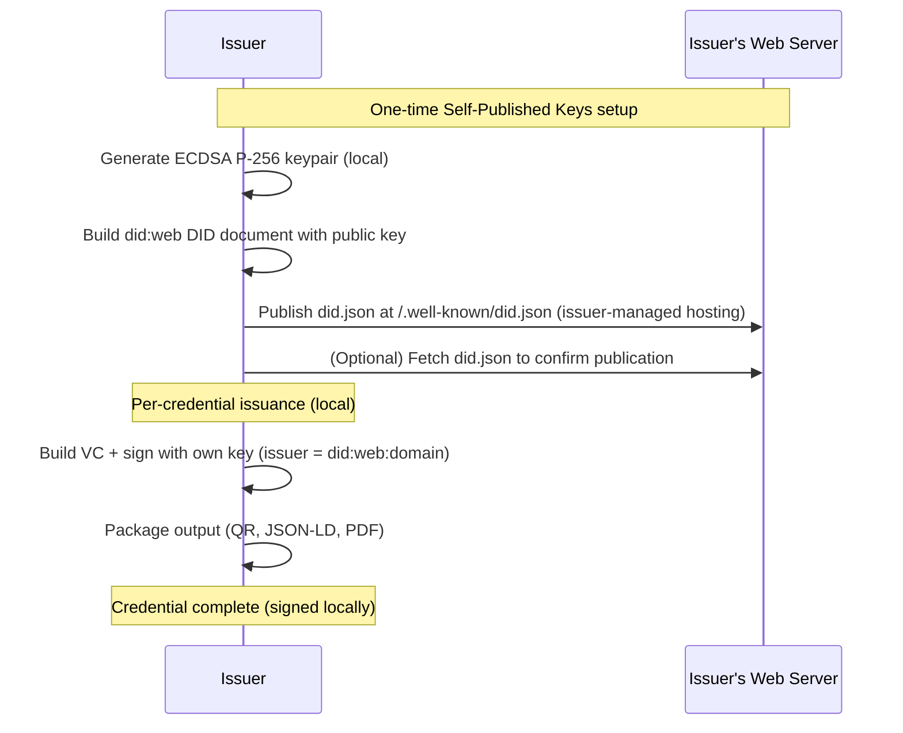
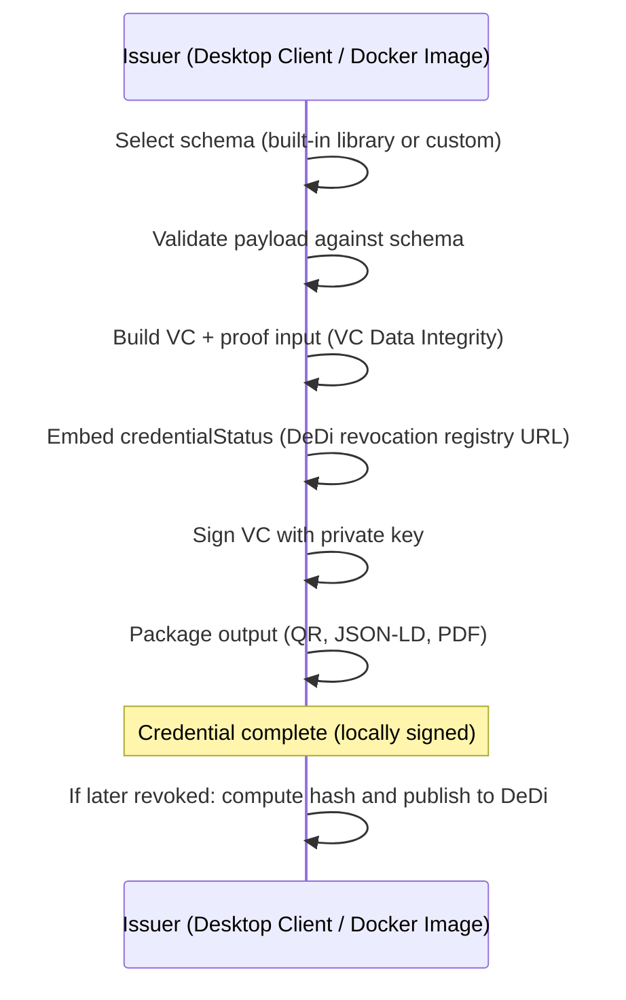
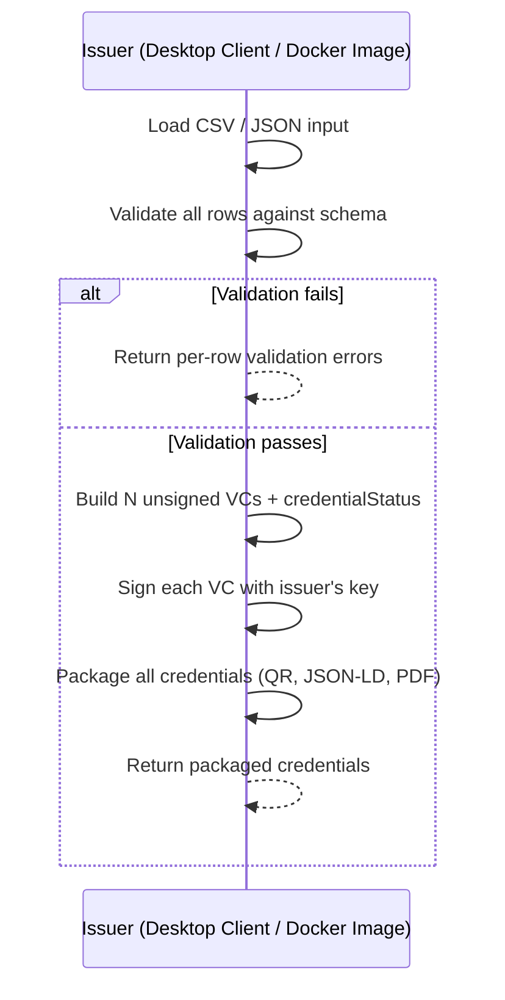
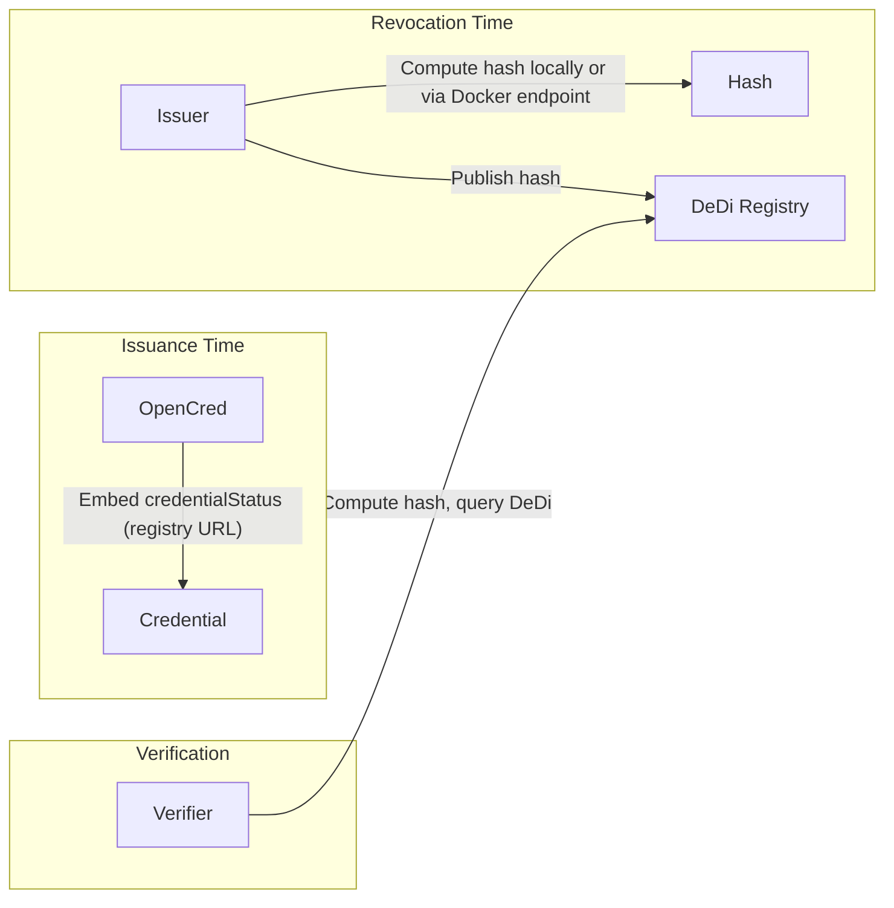
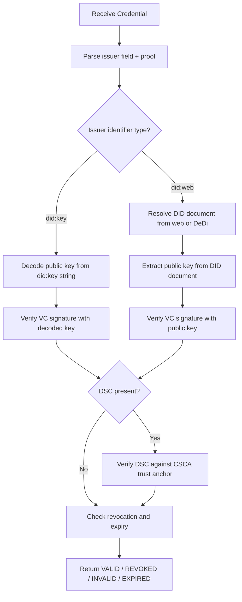
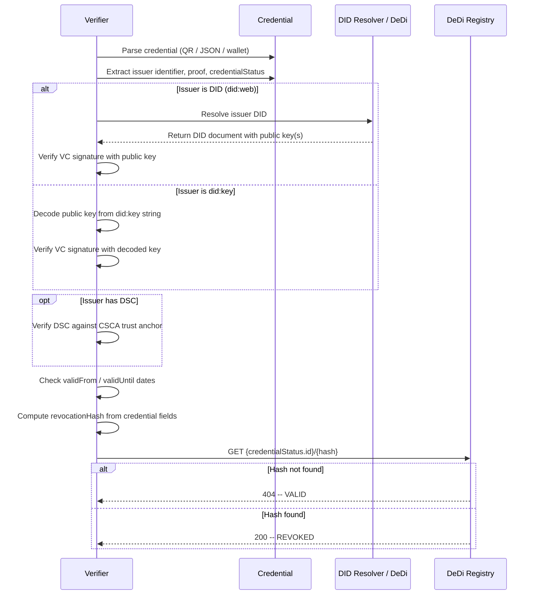

# OpenCred -- Product Requirements Document

**Edition**: Public
**Version**: 2.0
**Last updated**: July 2026

> This is the public edition of the OpenCred Product Requirements Document — the
> source of truth for what the product is and why. It is adapted from the internal
> PRD v2.0, with internal execution notes removed and the issuer-type model brought
> in line with the shipped v2 architecture (the former "OpenCred-Attested" path was
> replaced by **Self-Published Keys** — see Section 2.1.3). Like the rest of this
> repository, this document is licensed under the MIT License.

---

## Table of Contents

1. [Executive Summary](#1-executive-summary)
2. [Personas](#2-personas)
3. [Interfaces](#3-interfaces)
4. [Issuer -- Onboarding and Trust Establishment](#4-issuer----onboarding-and-trust-establishment)
5. [Issuer -- Key Sourcing Strategies](#5-issuer----key-sourcing-strategies)
6. [Issuer -- Self-Verifiable Credentials](#6-issuer----self-verifiable-credentials)
7. [Issuer -- credentialStatus for Revocation](#7-issuer----credentialstatus-for-revocation)
8. [Verifier -- Public Key Retrieval](#8-verifier----public-key-retrieval)
9. [Verifier -- Expiry and Revocation Checking](#9-verifier----expiry-and-revocation-checking)
10. [Appendix](#10-appendix)

---

## 1. Executive Summary

OpenCred is a desktop application for issuing and verifying W3C-conformant verifiable credentials. It is designed for any issuer -- from governments to individuals -- to produce verifiable credentials without OpenCred ever persisting private keys, credential data, or personal information. The issuer retains full control over their cryptographic material; all signing happens locally on the issuer's machine. OpenCred validates schemas, builds canonical credential structures, manages revocation indices, and packages output for download (JSON-LD, PDF, QR code). All session data -- credential payloads, built VCs, packaged output, and bulk issuance job results -- is purged within a configurable window (default: 4 hours). OpenCred computes revocation hashes on request but does not publish them to DeDi -- the issuer publishes hashes to their own DeDi registry. OpenCred does not handle credential delivery to holders; the issuer downloads the issued credential and manages distribution through their own workflows.

OpenCred is available through two interfaces: a **Desktop Client** (the primary product, fully local, offline-capable) and a **Docker Image** (a headless version of the same application for cloud deployment and workflow integration). Both interfaces support **Local Signing** only -- the issuer always signs with their own private key. For issuers without a Digital Signature Certificate (DSC), OpenCred generates a keypair locally and helps the issuer publish the public key as a `did:web` DID document on the issuer's own domain. Trust is then anchored in the domain's TLS certificate -- OpenCred is never a trust intermediary and never signs anything on the issuer's behalf.

OpenCred ships with a library of commonly used credential schemas (e.g., education certificates, employment credentials, identity documents, health records) so that issuers can begin issuing immediately without defining their own schemas. Issuers may also register custom schemas. Both Desktop Client and Docker Image receive periodic updates including new schemas and security patches.

Credential verification uses DeDi (Decentralized Directory) as the revocation registry.

---

## 2. Personas

### 2.1 Issuer

The entity that asserts claims about one or more subjects and produces a verifiable credential. Issuers include universities, employers, government agencies, healthcare providers, and individuals. The issuer always controls and uses their own signing key -- OpenCred never signs credentials on behalf of the issuer.

OpenCred supports three issuer types, differentiated by how they establish trust:

#### 2.1.1 Issuer with DSC

The issuer already holds a Digital Signature Certificate (DSC) issued by a recognised Certificate Authority (CSCA or equivalent). The issuer imports their DSC into OpenCred and signs credentials locally. Trust chain: VC signature → DSC → CSCA. This is the strongest trust model and typical of government agencies and large institutions.

#### 2.1.2 Issuer Seeking DSC

The issuer does not yet hold a DSC but wishes to obtain one. OpenCred facilitates the connection to Certificate Authority APIs or guides the issuer through independent DSC acquisition. Once the DSC is obtained, the issuer operates as an Issuer with DSC (2.1.1). This path serves as an extension point -- OpenCred does not custody the DSC or its private key.

#### 2.1.3 Self-Published Keys

The issuer does not hold a DSC and cannot readily obtain one, but controls a public web domain. The issuer generates an ECDSA P-256 keypair locally within OpenCred, and OpenCred builds a `did:web` DID document containing the public key. The issuer publishes that DID document at `https://<domain>/.well-known/did.json` on their own domain -- OpenCred never publishes on the issuer's behalf. The issuer then signs credentials with their own key, and verifiers resolve the issuer's `did:web` identifier to retrieve the public key. Trust chain: VC signature → published public key → `did:web` resolution → the domain's TLS certificate. This anchors trust in the issuer's own domain and the existing web PKI, without any centralised intermediary and without OpenCred appearing anywhere in the trust path.

### 2.2 Verifier

The entity that receives a verifiable credential (via QR scan, JSON file, or wallet presentation) and cryptographically verifies its authenticity, integrity, revocation status, and validity period. Verifiers include employers, border agencies, insurance companies, and online services. Verification validates the credential signature, checks the DSC chain when present, and queries DeDi for revocation status.

### 2.3 Holder / Subject

The recipient of the credential who stores it in a digital wallet (compatible with Inji, Google Wallet, Apple Wallet) and presents it to verifiers on demand. The holder is often, but not always, the subject of the credential.

---

## 3. Interfaces

OpenCred is available through two interfaces. Both interfaces produce identical W3C-conformant credentials; they differ in deployment model and user interaction.

### 3.1 Desktop Client

The primary OpenCred product. A fully local, offline-capable desktop application. The issuer's private key never leaves their machine. All signing is local.

| Property | Value |
|---|---|
| Deployment | Local install (Electron) |
| Network required | No (offline-capable; network needed for optional did:web publication checks, revocation hash publishing to DeDi, periodic schema updates) |
| Signing | Local only -- issuer signs with their own private key |
| Key custody | Issuer retains full custody; key never transmitted |
| Key sources | Software key files (PFX/PEM/JWK), OS certificate store (Windows CNG, macOS Keychain), hardware tokens (PKCS#11) |
| Use case | Primary issuance and verification, high-security environments, air-gapped systems, field deployment |

### 3.2 Docker Image

A headless version of the Desktop Client for cloud deployment and workflow integration. Provides the same credential issuance and verification capabilities without a GUI. Exposes endpoints for programmatic access and supports CLI mode for scripting and CI/CD integration.

| Property | Value |
|---|---|
| Deployment | Docker container (single image) |
| Network required | Yes (runs as a service) |
| Signing | Local within the container -- issuer's key loaded at startup or per request |
| Key custody | Issuer retains custody; key provided via mounted volume, environment variable, or cloud HSM reference |
| Key sources | Software key files (PFX/PEM/JWK), hardware tokens (PKCS#11), cloud HSM (AWS KMS, Azure Key Vault, GCP Cloud KMS) |
| Use case | Automated/batch issuance, system-to-system integration, cloud deployment, CI/CD pipelines |

All signing is local on both interfaces -- the issuer always signs with their own key. No interface, endpoint, or code path accepts an issuer's private key for transmission to OpenCred; keys stay on the issuer's machine or within the issuer's own container.

### 3.3 Built-in Schema Library

OpenCred ships with a curated set of commonly used credential schemas covering frequent issuance scenarios. These schemas are W3C VC Data Model 2.0 conformant and ready to use on both interfaces.

| Category | Example schemas |
|---|---|
| Education | Diploma, degree certificate, transcript, course completion, professional certification |
| Employment | Employment letter, experience certificate, reference letter |
| Identity | National ID, proof of address, age verification |
| Health | Vaccination record, test result, insurance card |
| Business | Business registration, trade licence, professional licence |

Issuers can select a built-in schema and populate it with their credential data, or register custom schemas for domain-specific use cases. Custom schemas are validated against JSON Schema / JSON-LD context rules before acceptance.

### 3.4 Access Model

OpenCred is a lightweight application. There are no user accounts and no login UI.

| Interface | Access model |
|---|---|
| **Desktop Client** | No authentication required. The application runs locally on the issuer's machine. |
| **Docker Image** | API key authentication via the `OPENCRED_API_KEY` environment variable (Bearer token on every protected endpoint). Authentication is fail-closed: the server refuses to start unless `OPENCRED_API_KEY` is set, or authentication is explicitly disabled for local development via `OPENCRED_DEV_MODE_NO_AUTH=true` (refused when `NODE_ENV=production`). |

---

## 4. Issuer -- Onboarding and Trust Establishment

This section describes how each issuer type (Section 2.1) establishes trust before issuing credentials. All signing is local -- the issuer always signs with their own key. The onboarding process establishes the issuer's identity, authority, and trust chain.

### 4.1 Issuer with DSC

No onboarding required. The issuer already holds a DSC issued by a recognised CSCA. They import their DSC (PFX or PEM file) into OpenCred, which extracts the certificate metadata, validates the chain against the configured CSCA trust store, and derives a DID. The issuer signs credentials locally with their DSC's private key. The verifier chains trust: VC → DSC → CSCA.

### 4.2 Issuer Seeking DSC

The issuer does not yet hold a DSC. OpenCred provides an extension point for Certificate Authority API integration, allowing the issuer to request a DSC through OpenCred's interface. The flow:

1. Issuer provides identity verification documents via OpenCred.
2. OpenCred forwards the request to the configured CA's issuance API.
3. CA verifies the issuer's identity and issues a DSC.
4. Issuer imports the DSC and proceeds as an Issuer with DSC (Section 4.1).

OpenCred acts as a facilitator -- it does not custody the DSC or its private key. The CA integration is configurable per deployment. Alternatively, the issuer may obtain a DSC independently through their CA and then import it.

### 4.3 Self-Published Keys (did:web)

The issuer does not hold a DSC and generates their own signing keys. Trust is established by publishing the public key on a domain the issuer controls. The flow:

1. **Key Generation**: The issuer generates an ECDSA P-256 keypair within OpenCred, using a CSPRNG. The private key stays on the issuer's machine (or within the Docker container).
2. **DID Document Generation**: The issuer provides their domain (e.g., `university.example`). OpenCred builds a `did:web` DID document whose `verificationMethod` contains the issuer's public key in JWK format (see the example in Section 6.1).
3. **Publication**: The issuer downloads the generated `did.json` and hosts it at `https://<domain>/.well-known/did.json` themselves. OpenCred never publishes on the issuer's behalf. Optionally, OpenCred fetches the published URL (over HTTPS, with SSRF protection) to confirm publication.
4. **Credential Issuance**: From then on, every credential the issuer signs carries `issuer: did:web:<domain>`. Verifiers resolve the DID through standard `did:web` resolution and trace trust: VC signature → published public key → `did:web` resolution → domain TLS certificate.



**Key rotation**: The issuer generates a new key, regenerates the DID document, and replaces the file at `.well-known/did.json`. Previously issued credentials remain verifiable as long as the issuer retains the old key's verification method in the document until those credentials expire.

---

## 5. Issuer -- Key Sourcing Strategies

All signing in OpenCred is local -- the issuer always signs with their own key. The core design constraint is that **OpenCred never receives, handles, or stores issuer private keys**. OpenCred validates schemas, builds canonical credential structures, and packages output; the issuer's private key stays on their machine (Desktop Client) or within their controlled environment (Docker Image).

OpenCred's **first implementation** standardises on the [W3C Verifiable Credentials Data Integrity 1.0](https://www.w3.org/TR/vc-data-integrity/) proof format for VC signatures. The [W3C Verifiable Credentials Data Model 2.0](https://www.w3.org/TR/vc-data-model-2.0/) remains the core data model, while JWT/JOSE, SD-JWT VC, and OpenID4VCI are deferred to later implementations (see [W3C VC JOSE/COSE](https://www.w3.org/TR/vc-jose-cose/), [IETF SD-JWT VC draft](https://datatracker.ietf.org/doc/draft-ietf-oauth-sd-jwt-vc/), and [OpenID4VCI 1.0](https://openid.net/specs/openid-4-verifiable-credential-issuance-1_0-final.html)).

This sequencing is intentional: v1 focuses on a single JSON-LD credential representation and one proof-verification path, which keeps issuance, revocation hashing, and verifier behavior simpler while avoiding wallet and protocol complexity (for example, format negotiation, holder binding, and OpenID4VCI issuance flows). This reduces implementation and interoperability risk for a minimalist application and preserves a clean upgrade path to JWT/SD-JWT/OpenID4VCI in later releases. **JCS** is used only for DeDi revocation hash computation (Section 7), not for VC proof signing.

### 5.1 Local Signing

All operations happen locally with the issuer's own key. The application performs schema validation, VC construction, signing, and packaging. The issuer's private key never leaves their environment. No data is transmitted to any hosted OpenCred service. This is the only signing flow -- all users sign locally.

**When to use**: All issuance scenarios. The Desktop Client performs all operations locally. The Docker Image performs all operations within the container using keys provided by the issuer.

**Trust assumptions**: The issuer's local environment (or container environment) is secure. The application software is trusted to correctly implement schema validation, VC construction, and packaging. No server-side trust required for signing.

**Security properties**: Lowest risk of key compromise -- no network exposure for signing operations. Requires the issuer to have signing capability (software key, hardware token, OS cert store, or cloud HSM) and either the Desktop Client installed or the Docker Image deployed.

#### 5.1.1 Key Sources

Issuers store their private keys in different environments. The table below lists the supported key sources and their availability on each interface.

| Key Source | Examples | Desktop Client | Docker Image |
|---|---|---|---|
| **Software key file** | PFX/P12, PEM, JWK on disk | Yes | Yes |
| **OS certificate store** | Windows Certificate Store (CNG), macOS Keychain | Yes | N/A |
| **Hardware token / smart card** | USB tokens (ePass, SafeNet, YubiKey), smart cards via PKCS#11 | Yes | Yes |
| **Cloud HSM** | AWS KMS, Azure Key Vault, Google Cloud KMS | No | Yes |

**Desktop Client**: Supports software key files, OS certificate store, and hardware tokens. Cloud HSM is not supported because the Desktop Client is designed for local, offline-capable operation.

**Docker Image**: Supports software key files, hardware tokens (via PKCS#11 library mounted in the container), and cloud HSM. OS certificate stores are not applicable in a container environment.

#### 5.1.2 Local Signing Sequence



### 5.2 Self-Published Keys (did:web)

For issuers without a DSC (Section 2.1.3), OpenCred generates a keypair locally and produces a `did:web` DID document the issuer publishes on their own domain. OpenCred is not part of the resulting trust chain -- trust is anchored entirely in the issuer's domain and its TLS certificate.

**When to use**: Issuers who do not hold a DSC and cannot readily obtain one, but control a public web domain and wish to issue credentials whose keys are independently verifiable.

**Trust chain**: VC signature → published public key → `did:web` resolution → domain TLS certificate (issued by a public CA).

**Trust assumptions**: The issuer controls their domain and its TLS certificate. The verifier's HTTPS client already trusts the web PKI, which is what anchors the chain. This mirrors patterns already used by some institutional issuers that publish signing keys at well-known HTTPS URLs.

**Security properties**:

- The issuer retains full control of their private key at all times; only the public key is published.
- No third party -- including OpenCred -- appears in the trust chain or can attest keys on the issuer's behalf.
- Key rotation is supported by updating the published DID document (Section 4.3); old keys can be retained so previously issued credentials remain verifiable.
- Domain compromise is the primary risk: an attacker controlling the domain could replace the published keys. Issuers should protect domain and hosting credentials accordingly, and rotate keys if compromise is suspected.

### 5.3 Key Source Matrix

| Key Source | Desktop Client | Docker Image | Trust Chain |
|---|---|---|---|
| Software key file (PFX/PEM/JWK) | Yes | Yes | Signature → key (no PKI chain unless the key is from a DSC) |
| OS certificate store (CNG, Keychain) | Yes | N/A | Signature → DSC → CSCA |
| Hardware token (PKCS#11) | Yes | Yes | Signature → DSC → CSCA (if token holds DSC key) |
| Cloud HSM (KMS, Key Vault) | No | Yes | Signature → DSC → CSCA (if HSM holds DSC key) |
| Generated key + self-published did:web | Yes | Yes | Signature → published key → did:web resolution → domain TLS |

### 5.4 Bulk Issuance

Bulk issuance allows an issuer to issue many credentials in a single operation. All credentials in a batch MUST use the same schema. Bulk issuance is available on both interfaces.

#### 5.4.1 Input Formats

| Format | Supported interfaces | Description |
|---|---|---|
| **CSV** | Desktop Client, Docker Image | Each row is one credential. Columns map to credential subject fields. A header row defines the field names. The schema is specified separately (as a parameter or selected in the UI). |
| **JSON array** | Docker Image | Array of credential payload objects. Each object contains the `credentialSubject` fields. The schema is specified once at the batch level. |

#### 5.4.2 Processing Model

**Desktop Client**: The Desktop Client reads the CSV locally, builds each VC, signs with the issuer's key, and packages the output -- all locally. No revocation hash is published at issuance time. If a credential is later revoked, the Desktop Client computes the revocation hash locally and publishes it to DeDi when online.

**Docker Image**: The Docker Image processes batches programmatically. Submit a batch via endpoint or CLI, and the Docker Image validates, builds, signs (using the configured key), and packages all credentials. Results are returned as a batch response.

| Step | Docker Image Endpoint / Action | Response |
|---|---|---|
| Submit batch | `POST /v1/credentials/batch` | `202 Accepted { jobId, status: "queued" }` |
| Poll status | `GET /v1/credentials/batch/{jobId}` | `{ status, total, succeeded, failed }` |
| Retrieve results | `GET /v1/credentials/batch/{jobId}/results` | Per-row results with individual status and error details |

#### 5.4.3 Error Handling: Validate-First, Then Issue

Batch processing uses a two-phase approach:

1. **Validation phase**: All rows are validated against the schema before any credentials are issued. If any rows fail validation, the entire batch is rejected with a per-row validation report. The issuer fixes errors and resubmits. No credentials are issued in this phase.
2. **Issuance phase**: Once validation passes, credentials are issued. Each credential is processed independently. If a system error occurs on one row (e.g., signing failure), the remaining credentials are still issued. The results report per-row status: `issued`, `failed` (with error reason).

#### 5.4.4 Bulk Issuance Sequence



**Limits:** v1 max 500-1,000 rows per batch. 10,000 rows marked as future optimization target (requires durable store/queue).

---

## 6. Issuer -- Self-Verifiable Credentials

A credential is "self-verifiable" when a verifier can authenticate it without relying on a proprietary lookup or out-of-band trust establishment. There are three primary approaches for making the public key available to verifiers.

### 6.1 Option A: Publish Public Key to a Web-Accessible Endpoint

The issuer publishes their public key(s) inside a DID document hosted at a well-known web URL. The most common method is `did:web`.

**Mechanism**: The issuer hosts a DID document at `https://<domain>/.well-known/did.json`. This document contains one or more `verificationMethod` entries with the public key(s) in JWK or Multibase format. The credential's `issuer` field contains the DID (e.g., `did:web:example.com`), which the verifier resolves to fetch the public key.

**Example DID Document** (`https://university.example/.well-known/did.json`):

```json
{
  "@context": [
    "https://www.w3.org/ns/did/v1",
    "https://w3id.org/security/suites/jws-2020/v1"
  ],
  "id": "did:web:university.example",
  "verificationMethod": [
    {
      "id": "did:web:university.example#key-1",
      "type": "JsonWebKey2020",
      "controller": "did:web:university.example",
      "publicKeyJwk": {
        "kty": "EC",
        "crv": "P-256",
        "x": "f83OJ3D2xF1Bg8vub9tLe1gHMzV76e8Tus9uPHvRVEU",
        "y": "x_FEzRu9m36HLN_tue659LNpXW6pCyStikYjKIWI5a0"
      }
    }
  ],
  "authentication": ["did:web:university.example#key-1"],
  "assertionMethod": ["did:web:university.example#key-1"]
}
```

**Advantages**:

- Follows standard DID resolution (W3C DID Core 1.0, DID Resolution v0.3).
- Supports key rotation: the issuer updates the DID document with new keys while retaining old ones for previously-issued credentials.
- Widely supported by VC libraries and wallets.
- The domain's TLS certificate provides an additional layer of trust binding the DID to the organisation.

**Disadvantages**:

- Requires the issuer to maintain a publicly accessible web endpoint.
- The credential is not self-contained; verification requires a network call to resolve the DID.
- A compromised or unavailable domain prevents verification.

### 6.2 Option B: Embed Public Key Inside the Credential (`did:key`)

The public key is encoded directly within the credential itself via a `did:key` identifier.

**Mechanism (did:key)**: The `did:key` method encodes the public key directly into the DID string. For example, `did:key:z6MkhaXg...` contains the full public key material. The verifier extracts and decodes the key from the DID without any network lookup.

**Example using did:key in the issuer field**:

```json
{
  "@context": ["https://www.w3.org/ns/credentials/v2"],
  "type": ["VerifiableCredential"],
  "issuer": "did:key:z6MkhaXgBZDvotDkL5257faiztiGiC2QtKLGpbnnEGta2doK",
  "validFrom": "2026-01-15T00:00:00Z",
  "credentialSubject": {
    "id": "did:example:holder123",
    "degree": {
      "type": "BachelorDegree",
      "name": "Bachelor of Science"
    }
  }
}
```

**Advantages**:

- Fully self-contained: verification is possible entirely offline with zero network dependency.
- Zero infrastructure needed by the issuer for key hosting.
- Ideal for ad-hoc, peer-to-peer, or field scenarios where connectivity is unreliable.

**Disadvantages**:

- No key rotation support: if the key is compromised, all credentials containing that key are affected and there is no mechanism to update the key material.
- Credential size increases because the key material is encoded in the identifier.
- Trust anchoring is weaker -- the verifier must trust the key in the credential itself without an external trust root.

### 6.3 Option C: KERI -- Key Event Receipt Infrastructure

KERI provides a third model for self-verifiable credentials built on **self-certifying identifiers (SCIDs)** rather than web-hosted documents or embedded keys. The issuer's identifier is cryptographically derived from its inception key and is bound to an append-only **Key Event Log (KEL)** that records every key rotation, delegation, and revocation event.

**Mechanism**: The issuer creates an Autonomic Identifier (AID) whose root of trust is a cryptographic keypair, not a domain name or a registry. The AID is strongly bound at inception to the controlling keypair through a self-certifying prefix. Key state changes (rotations, delegations) are recorded as signed events in the KEL. Witnesses (a configurable set of receipt-generating nodes) countersign key events, providing a secondary root of trust without requiring a blockchain or centralised registry.

**Key pre-rotation**: KERI's defining feature is its pre-rotation scheme. At inception (or at any rotation), the issuer pre-commits to the hash of the *next* rotation key. This means an attacker who compromises the current signing key cannot rotate to a new key of their choosing -- only the pre-committed key (held offline by the issuer) can perform the rotation. This eliminates the foundational weakness of traditional PKI where a compromised key can authorise its own replacement.

**Trust modes**:

- **Direct mode**: The verifier obtains the KEL directly from the issuer or a mutually trusted witness. The verifier replays the KEL from inception to current state, verifying every event signature. No external registry needed.
- **Indirect mode**: Witnesses produce Key Event Receipt Logs (KERLs). The verifier fetches KERLs from multiple witnesses and applies KERI's Agreement Algorithm for Control Establishment (KA2CE) to reach consensus on the current key state. This provides high assurance even when the verifier has no direct relationship with the issuer.

**Example AID (simplified)**:

```
AID: EDP1vHcw_wc4M0MPCus291a6-lcU0Jv38ypPuw52HFz0
```

The AID prefix is derived from the inception event's public key, making it self-certifying. The verifier resolves the AID to a KEL (from the issuer, a witness, or a KERI watcher node) and replays it to obtain the current public key.

**Advantages**:

- **Secure key rotation via pre-rotation**: Key compromise does not enable attacker-controlled rotation, unlike `did:web` where domain compromise allows full key replacement.
- **No dependency on web infrastructure**: The identifier is not bound to a domain name, so domain expiry, DNS hijacking, or TLS certificate issues do not affect the identifier's integrity.
- **Decentralised without a blockchain**: Witnesses provide distributed consensus on key state without requiring a ledger.
- **End-verifiable**: Any party can independently verify the full key event history by replaying the KEL from inception.
- **Supports delegation natively**: KERI has built-in delegated AIDs where a delegator AID authorises a delegate AID via a delegation event in the KEL, aligning well with trust chain models.

**Disadvantages**:

- **Ecosystem maturity**: KERI specifications are at v0.9 (Trust Over IP Foundation / IETF draft). Library and wallet support is growing but not yet as widespread as `did:web` or `did:key`.
- **Operational complexity**: Issuers must manage witness infrastructure (or use a witness network provider) and maintain their KEL.
- **Verifier must obtain the KEL**: While no web server is needed, the verifier still requires access to the KEL (via a watcher, witness, or direct exchange). Fully offline verification is possible only if the KEL is bundled with the credential.
- **Credential size if KEL is embedded**: Bundling the KEL for offline verification increases credential size proportional to the number of key events.

### 6.4 Comparative Analysis

| Criterion | Option A (did:web) | Option B (did:key) | Option C (KERI) |
|---|---|---|---|
| Network dependency at verification | Yes (DID resolution) | No (offline capable) | Partial (KEL fetch, or offline if bundled) |
| Key rotation | Supported (update DID doc) | Not supported | Supported (pre-rotation, cryptographically pre-committed) |
| Pre-rotation security | No (domain compromise enables malicious rotation) | N/A | Yes (compromised key cannot authorise its own replacement) |
| Issuer infrastructure | Web server + TLS cert | None | Witness nodes (self-hosted or provider) |
| Credential size | Smaller (key not embedded) | Larger (+200-400 bytes) | Moderate (AID only) or larger if KEL bundled |
| Trust anchoring | Domain-bound (TLS + DID doc) | Self-asserted | Self-certifying (cryptographic inception binding) |
| Revocation of compromised key | Update DID document | No mechanism (must revoke all affected credentials) | Rotate via pre-committed key; old key provably superseded |
| Decentralisation | Depends on DNS/TLS CA | Fully decentralised (no resolution) | Fully decentralised (witness consensus, no blockchain) |
| Standards maturity | W3C CCG did:web spec | W3C CCG did:key v0.9 | ToIP / IETF draft v0.9; growing implementations |

### 6.5 Recommendation

OpenCred SHOULD support all three options and let the issuer choose at issuance time:

- **Default for institutional issuers and Self-Published Keys issuers**: `did:web` -- provides key rotation, domain-bound trust, and aligns with enterprise identity infrastructure. Lowest barrier to adoption given existing web PKI. Self-Published Keys issuers (Section 2.1.3) use `did:web` by construction.
- **Default for offline-first use**: `did:key` -- enables fully self-contained credentials for field deployment, peer-to-peer issuance, or testing.
- **For high-assurance / decentralised deployments**: KERI -- provides cryptographically pre-committed key rotation, native delegation, and decentralised trust without blockchain dependency. Recommended for issuers who require resilience against domain compromise or who operate in multi-stakeholder trust frameworks (e.g., government-to-government credential exchange).

---

## 7. Issuer -- credentialStatus for Revocation

Per the [W3C VC Data Model 2.0 -- Status](https://www.w3.org/TR/vc-data-model-2.0/#status), every credential issued by OpenCred MUST include a `credentialStatus` property to enable revocation checking by verifiers.

### 7.1 DeDi Revocation List v1 (Hash Lookup)

OpenCred uses a deterministic hash-based revocation model backed by DeDi. Under **DeDi Revocation List v1**, each credential has a deterministic revocation hash derivable from the credential body. DeDi stores **only revoked hashes** (not issuance-time hashes).

**Revocation hash computation**:

```
issuedAt = credential.validFrom (if present) else credential.issuanceDate
revocationHash = SHA-256( JCS({
  "credentialSubject": credential.credentialSubject,
  "id": credential.id,
  "issuedAt": issuedAt,
  "issuer": credential.issuer
}) )
```

Where **JCS** is [JSON Canonicalization Scheme (RFC 8785)](https://www.rfc-editor.org/rfc/rfc8785). If neither `validFrom` nor `issuanceDate` is present, the revocation hash cannot be computed and the credential fails revocation verification for this status type.

**credentialStatus field** embedded in the credential:

```json
{
  "credentialStatus": {
    "id": "https://dedi.example/revocations/university.example/revocation-registry",
    "type": "DeDiRevocationListStatusV1",
    "statusPurpose": "revocation"
  }
}
```

The `id` is the issuer's public DeDi revocation registry URL (base path). For `DeDiRevocationListStatusV1`, OpenCred requires `credentialStatus.id` even though `id` is optional in the W3C core model.

**Issuance flow**: OpenCred embeds `credentialStatus` with the issuer's DeDi revocation registry URL. No revocation hash is published at issuance time.

**Revocation flow**: The issuer revokes a credential by computing the hash locally (Desktop Client) or via the Docker Image's endpoint, and then publishes the hash to their own namespace in DeDi. OpenCred never publishes to DeDi on behalf of the issuer.

**Verification flow**: The verifier computes the same hash from the credential fields and queries DeDi. Hash found = REVOKED, not found = VALID.

### 7.2 DeDi as the Backing Store

DeDi (Decentralized Directory) serves as the verifiable data registry. Each issuer has a namespace in DeDi.



### 7.3 Revocation Hash Computation

OpenCred provides hash-computation capabilities on both interfaces. It does **not** publish hashes to DeDi -- the issuer is responsible for publishing to their own DeDi registry.

**Desktop Client**: Computes revocation hashes locally. Single credential or batch (from loaded CSV).

**Docker Image endpoints**:

| Endpoint | Method | Request Body | Response | Description |
|---|---|---|---|---|
| `/v1/credentials/revocation-hash` | POST | `{ "credential": { ... } }` | `{ "revocationHash": "<sha256-hex>" }` | Compute the revocation hash for a single credential. |
| `/v1/credentials/revocation-hash/batch` | POST | `{ "credentials": [{...}, {...}, ...] }` | `{ "revocationHashes": [{ "credentialId": "...", "revocationHash": "<sha256-hex>" }, ...] }` | Compute revocation hashes for multiple credentials. |

### 7.4 Revocation Lifecycle

| Step | Actor | Action | Details |
|---|---|---|---|
| At issuance | OpenCred | Embeds `credentialStatus` | Includes the issuer's DeDi revocation registry URL (`credentialStatus.id`) and status type `DeDiRevocationListStatusV1`. |
| To revoke | Issuer | Computes hash | Desktop Client: compute locally. Docker Image: `POST /v1/credentials/revocation-hash`. |
| To revoke | Issuer | Publishes hash to DeDi | The issuer publishes the revocation hash to their own DeDi revocation registry. OpenCred does not publish on the issuer's behalf. |
| Bulk revoke | Issuer | Computes hashes in batch | Desktop Client: batch hash computation from loaded credentials. Docker Image: `POST /v1/credentials/revocation-hash/batch`. The issuer publishes them to DeDi. |

### 7.5 Note on W3C BitstringStatusList

OpenCred does not implement [W3C Bitstring Status List v1.0](https://www.w3.org/TR/vc-bitstring-status-list/). Issuers with the technical capacity to manage compressed bitstrings are free to implement BitstringStatusList independently and embed the appropriate `credentialStatus` in their credentials. OpenCred's verifier will branch on `credentialStatus.type`: it applies the DeDi hash lookup only for `DeDiRevocationListStatusV1`, and applies Bitstring Status List processing when `BitstringStatusListEntry` is present. OpenCred will not generate or host bitstring status lists.

### 7.6 Future Revocation Models

The current model requires the issuer to publish revocation hashes to DeDi independently. Future iterations may introduce alternative revocation models:

- **Signed Revocation Receipts**: OpenCred returns a signed receipt confirming the hash computation. The issuer can present this receipt to DeDi (or any registry) as proof that the hash was computed correctly, without requiring DeDi-specific integration in OpenCred.
- **Per-Request Credential Pass-Through**: Instead of persisting any revocation state, the issuer sends the full credential to a verification endpoint at revocation-check time and receives an immediate revoked/valid response. This eliminates the need for a persistent registry but requires the issuer to retain credential copies.

These models are not currently implemented. If adopted, they will be specified in dedicated subsections of this chapter and reflected in the endpoint contract.

---

## 8. Verifier -- Public Key Retrieval

The verifier needs to obtain the issuer's public key to verify the credential's signature. Three options are available, depending on how the credential was issued.

### 8.1 Option 1: DID Resolution

The verifier resolves the `issuer` DID from the credential (e.g., `did:web:university.example`) using the [W3C DID Resolution](https://www.w3.org/TR/did-resolution/) process. This fetches the DID document from the issuer's domain and extracts the public key from the `verificationMethod` array.

**Applies when**: The credential's `issuer` field is a `did:web` identifier.

**Steps**:
1. Parse `issuer` field from the credential.
2. Resolve the DID using the appropriate DID method driver (e.g., `did:web` resolves to `https://<domain>/.well-known/did.json`).
3. Extract the `verificationMethod` referenced in the credential's `proof.verificationMethod`.
4. Use the extracted public key to verify the VC signature.

### 8.2 Option 2: DeDi Lookup

The verifier queries the DeDi registry for the issuer's DID document or public key(s). DeDi acts as a caching layer and verifiable data registry, providing faster lookups and availability guarantees.

**Applies when**: The verifier is configured to use DeDi as its resolution backend, or the credential's `issuer` DID is registered in DeDi.

**Steps**:
1. Parse `issuer` DID from the credential.
2. Query DeDi: `GET /dedi/resolve/{issuerDID}`.
3. DeDi returns the DID document (or a cached copy) with public key(s).
4. Extract the relevant public key and verify the VC signature.

### 8.3 Option 3: Embedded Key Extraction

If the credential uses `did:key` as the issuer identifier, the verifier extracts the public key directly from the credential without any network call.

**Applies when**: The credential's `issuer` field is a `did:key` identifier.

**Steps**:
1. If `issuer` is `did:key:z6Mk...`, decode the Multibase-encoded public key from the DID string.
2. Use the extracted public key to verify the VC signature.

**Caveat**: This option provides cryptographic verification but not trust anchoring. The verifier must decide whether to trust a self-asserted key or require additional out-of-band evidence (for DSC-derived keys, the DSC chain to the CSCA provides that anchoring).

### 8.4 Decision Table

| Credential Characteristic | Key Retrieval Option | Network Required |
|---|---|---|
| `issuer` = `did:web:*` | Option 1 (DID Resolution) or Option 2 (DeDi) | Yes |
| `issuer` = `did:key:*` | Option 3 (Embedded Key) | No |
| Issuer has DSC | Verify DSC against CSCA trust anchor after key retrieval | Only for CSCA validation |

### 8.5 Verification Flow Overview



---

## 9. Verifier -- Expiry and Revocation Checking

After verifying the cryptographic signature, the verifier MUST check whether the credential is still current (not expired) and has not been revoked by the issuer.

### 9.1 Expiry Check

The W3C VC Data Model 2.0 uses `validFrom` and `validUntil` fields (replacing the v1.1 `issuanceDate` and `expirationDate` fields, though both are supported).

**Steps**:
1. Read the `validUntil` (or `expirationDate`) field from the credential.
2. Compare with the current date/time (UTC).
3. If the current date is **after** `validUntil`, the credential is **EXPIRED**.
4. Optionally, check `validFrom` -- if the current date is **before** `validFrom`, the credential is **NOT YET VALID**.

**Example fields in a credential**:

```json
{
  "validFrom": "2026-01-15T00:00:00Z",
  "validUntil": "2027-01-15T00:00:00Z"
}
```

### 9.2 Revocation Check

The verifier checks revocation using the `credentialStatus` field embedded in the credential. The DeDi hash lookup below applies when `credentialStatus.type = "DeDiRevocationListStatusV1"`. If `credentialStatus.type = "BitstringStatusListEntry"`, the verifier follows the W3C Bitstring Status List processing rules instead.

**DeDi Revocation List v1 (Hash Lookup)**:

1. Extract the DeDi revocation registry base URL from `credentialStatus.id`.
2. Compute `issuedAt = validFrom` if present, else `issuanceDate`.
3. Compute `revocationHash = SHA-256(JCS({ credentialSubject, id, issuedAt, issuer }))`.
4. Query DeDi: `GET {credentialStatus.id}/{revocationHash}`.
5. Hash found = **REVOKED**. Not found = **VALID**.

### 9.3 Caching Strategy

| Parameter | Value |
|---|---|
| What to cache | DeDi query responses |
| Cache TTL | 1-5 minutes |
| Offline verification | Signature verification may be offline for embedded-key credentials, but revocation checks require DeDi connectivity (or a fresh cache) |
| Stale fallback | Return UNRESOLVABLE if DeDi is unreachable |

### 9.4 Verification Result Codes

| Result | Condition |
|---|---|
| **VALID** | Signature verified, not expired, not revoked. |
| **REVOKED** | Signature verified, but revocation hash found in DeDi. |
| **EXPIRED** | Signature verified, but `validUntil` date has passed. |
| **INVALID** | Signature verification failed (tampered or wrong key). |
| **UNRESOLVABLE** | The issuer's DID could not be resolved, or DeDi is unreachable and no cache is available. |

### 9.5 Full Verification Sequence



---

## 10. Appendix

### 10.1 Sample Verifiable Credential -- Issuer with DSC

The following example shows a fully-formed verifiable credential issued by an issuer with a DSC, using Local Signing:

```json
{
  "@context": [
    "https://www.w3.org/ns/credentials/v2",
    "https://w3id.org/security/data-integrity/v1"
  ],
  "id": "urn:uuid:7c5c3e9a-2a1f-4d3b-8e4c-123456789abc",
  "type": ["VerifiableCredential"],
  "issuer": "did:web:university.example",
  "validFrom": "2026-02-09T00:00:00Z",
  "validUntil": "2027-02-09T00:00:00Z",
  "credentialSubject": {
    "id": "did:example:holder456",
    "name": "Jane Doe",
    "degree": {
      "type": "BachelorDegree",
      "name": "Bachelor of Computer Science",
      "institution": "Example University"
    }
  },
  "credentialStatus": {
    "id": "https://dedi.example/revocations/university.example/revocation-registry",
    "type": "DeDiRevocationListStatusV1",
    "statusPurpose": "revocation"
  },
  "proof": {
    "type": "DataIntegrityProof",
    "cryptosuite": "ecdsa-rdfc-2019",
    "created": "2026-02-09T00:00:00Z",
    "verificationMethod": "did:web:university.example#key-1",
    "proofPurpose": "assertionMethod",
    "proofValue": "z3FXQjecWufY46yXm..."
  }
}
```

### 10.2 Sample Verifiable Credential -- Self-Published Keys Issuer

The following example shows a credential issued by a Self-Published Keys issuer. The `issuer` is a `did:web` identifier resolving to the DID document the issuer hosts on their own domain:

```json
{
  "@context": [
    "https://www.w3.org/ns/credentials/v2",
    "https://w3id.org/security/data-integrity/v1"
  ],
  "id": "urn:uuid:a1b2c3d4-e5f6-7890-abcd-ef1234567890",
  "type": ["VerifiableCredential"],
  "issuer": "did:web:example-corp.com",
  "validFrom": "2026-03-13T00:00:00Z",
  "validUntil": "2027-03-13T00:00:00Z",
  "credentialSubject": {
    "id": "did:example:employee789",
    "name": "John Smith",
    "employment": {
      "type": "EmploymentCredential",
      "employer": "Example Corp Ltd",
      "position": "Software Engineer",
      "startDate": "2025-01-15"
    }
  },
  "credentialStatus": {
    "id": "https://dedi.example/revocations/example-corp.com/revocation-registry",
    "type": "DeDiRevocationListStatusV1",
    "statusPurpose": "revocation"
  },
  "proof": {
    "type": "DataIntegrityProof",
    "cryptosuite": "ecdsa-rdfc-2019",
    "created": "2026-03-13T00:00:00Z",
    "verificationMethod": "did:web:example-corp.com#key-0",
    "proofPurpose": "assertionMethod",
    "proofValue": "z4sB9Dk7Wq..."
  }
}
```

The verifier resolves `did:web:example-corp.com` to `https://example-corp.com/.well-known/did.json`, extracts the public key from the referenced verification method, and verifies the signature. Trust is anchored in the domain's TLS certificate.

### 10.3 Sample credentialStatus (Standalone)

```json
{
  "credentialStatus": {
    "id": "https://dedi.example/revocations/university.example/revocation-registry",
    "type": "DeDiRevocationListStatusV1",
    "statusPurpose": "revocation"
  }
}
```

### 10.4 Sample Revocation Hash Computation

**Desktop Client**: Computed locally -- no network call.

**Docker Image -- single hash**:

```bash
curl -X POST http://localhost:3000/v1/credentials/revocation-hash \
  -H "Content-Type: application/json" \
  -H "Authorization: Bearer <OPENCRED_API_KEY>" \
  -d '{
    "credential": { ... }
  }'
# Response: { "revocationHash": "a1b2c3d4e5f6...sha256hex" }
```

**Docker Image -- batch hashes**:

```bash
curl -X POST http://localhost:3000/v1/credentials/revocation-hash/batch \
  -H "Content-Type: application/json" \
  -H "Authorization: Bearer <OPENCRED_API_KEY>" \
  -d '{
    "credentials": [{ ... }, { ... }]
  }'
# Response: { "revocationHashes": [{ "credentialId": "...", "revocationHash": "..." }, ...] }
```

### 10.5 Glossary

| Term | Definition |
|---|---|
| **CSCA** | Country Signing Certificate Authority. The root certificate authority in a national PKI hierarchy (e.g., used in ICAO e-passports). The CSCA signs Digital Signature Certificates. |
| **DeDi** | Decentralized Directory. A verifiable data registry used by OpenCred for DID resolution, public key caching, and revocation status hosting. DeDi does not generate or store any signing keys. |
| **DID** | Decentralized Identifier. A portable, URL-based identifier (e.g., `did:web:example.com`) associated with an entity and resolvable to a DID document containing public keys and service endpoints. |
| **did:key** | A DID method that encodes the public key directly in the DID string (e.g., `did:key:z6Mk...`). No registry or network resolution needed. Best for offline use. |
| **did:web** | A DID method that resolves to a DID document hosted at `https://<domain>/.well-known/did.json`. Leverages existing web PKI (TLS) for trust anchoring. |
| **DSC** | Digital Signature Certificate. An intermediate certificate issued by a CSCA, used by an organisation to sign documents or credentials. |
| **JCS** | JSON Canonicalization Scheme (RFC 8785). A deterministic serialisation of JSON objects used to produce a consistent byte representation for hashing or signing. |
| **JWK** | JSON Web Key (RFC 7517). A JSON data structure representing a cryptographic key, commonly used to embed public keys in DID documents and VC proofs. |
| **KEL** | Key Event Log. An append-only, cryptographically signed log of key lifecycle events (inception, rotation, delegation, revocation) used in KERI to establish verifiable key state. |
| **KERI** | Key Event Receipt Infrastructure. A decentralised key management protocol that uses self-certifying identifiers and pre-rotation to provide secure, end-verifiable control over cryptographic keys without reliance on a blockchain or centralised registry. |
| **Self-Published Keys** | OpenCred's onboarding path for issuers without a DSC: a locally generated keypair whose public key the issuer publishes in a `did:web` DID document on their own domain. Trust is anchored in the domain's TLS certificate; OpenCred is not part of the trust chain. |
| **VC** | Verifiable Credential. A tamper-evident, cryptographically signed credential conforming to the W3C VC Data Model. |
| **VP** | Verifiable Presentation. A tamper-evident wrapper around one or more VCs, presented by a holder to a verifier. |

### 10.6 References

| Reference | URL |
|---|---|
| W3C VC Data Model 2.0 | https://www.w3.org/TR/vc-data-model-2.0/ |
| W3C Bitstring Status List v1.0 | https://www.w3.org/TR/vc-bitstring-status-list/ |
| W3C VC Data Integrity 1.0 | https://www.w3.org/TR/vc-data-integrity/ |
| W3C Securing VCs using JOSE and COSE | https://www.w3.org/TR/vc-jose-cose/ |
| IETF SD-JWT VC Draft | https://datatracker.ietf.org/doc/draft-ietf-oauth-sd-jwt-vc/ |
| OpenID4VCI 1.0 | https://openid.net/specs/openid-4-verifiable-credential-issuance-1_0-final.html |
| did:web Method Specification | https://w3c-ccg.github.io/did-method-web/ |
| did:key Method v0.9 | https://w3c-ccg.github.io/did-key-spec/ |
| W3C DID Resolution v0.3 | https://www.w3.org/TR/did-resolution/ |
| W3C DID Core 1.0 | https://www.w3.org/TR/did-core/ |
| KERI Specification (ToIP / IETF draft) | https://trustoverip.github.io/tswg-keri-specification/ |
| JSON Canonicalization Scheme (RFC 8785) | https://www.rfc-editor.org/rfc/rfc8785 |
| JSON Web Key (RFC 7517) | https://www.rfc-editor.org/rfc/rfc7517 |
| DeDi API OpenAPI Specification | https://github.com/nfh-trust-labs/docs/blob/main/openAPI.yaml |
